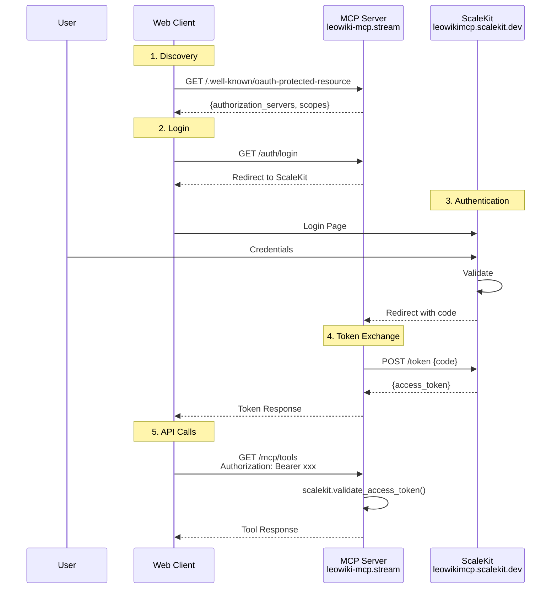

# Phase 1: OAuth 2.1 Authentifizierung für Web-Clients

## LeoWiki MCP Server - ScaleKit SDK Integration

> **Stand: 19. Januar 2026**
> **Basiert auf: Repository `mcp-diploma-thesis-final`**

---

## Übersicht

Diese Phase implementiert OAuth 2.1 Authentifizierung für **Web-basierte MCP-Clients** unter Verwendung des **offiziellen ScaleKit SDK**. Kein Proxy erforderlich.

### Vorteile des ScaleKit SDK (vs. manuelle JWT-Validierung)

| Aspekt | ScaleKit SDK | Manuell (PyJWT) |
|--------|-------------|-----------------|
| JWKS Caching | ✅ Automatisch | ⚠️ Selbst implementieren |
| Key Rotation | ✅ Automatisch | ⚠️ Selbst implementieren |
| Token Validierung | ✅ Eine Zeile | ⚠️ ~50 Zeilen Code |
| Wartung | ✅ Von ScaleKit | ⚠️ Selbst |
| Fehlerbehandlung | ✅ Standardisiert | ⚠️ Selbst |

### Unterstützte Clients in Phase 1

- ✅ Claude.ai (Web)
- ✅ Browser-basierte MCP Clients
- ✅ Web-UIs mit OAuth Support
- ✅ API-Zugriffe mit Bearer Token

### Nicht unterstützt in Phase 1

- ❌ Claude Desktop (braucht Proxy → Phase 2)
- ❌ Cursor IDE (braucht Proxy → Phase 2)
- ❌ Cline/VSCode (braucht Proxy → Phase 2)
- ❌ Andere stdio-basierte Clients

---

## Architektur

```
┌─────────────────────────────────────────────────────────────────────┐
│                    PHASE 1: WEB CLIENT ARCHITEKTUR                   │
│                    (mit ScaleKit SDK)                                │
└─────────────────────────────────────────────────────────────────────┘

                    ┌───────────────────────┐
                    │      Web Client       │
                    │  (Claude.ai, Browser) │
                    └───────────┬───────────┘
                                │
                    1. Discovery│
                                ▼
              ┌─────────────────────────────────────────┐
              │  /.well-known/oauth-protected-resource  │
              │    (JSON von ScaleKit Dashboard)        │
              └─────────────────┬───────────────────────┘
                                │
                    2. OAuth Flow
                                ▼
              ┌─────────────────────────────────────┐
              │         ScaleKit OAuth 2.1          │
              │    leowikimcp.scalekit.dev          │
              │                                     │
              │  • /oauth/authorize (Login)         │
              │  • /oauth/token (Token Exchange)    │
              │  • /.well-known/jwks.json (Keys)    │
              └─────────────────┬───────────────────┘
                                │
                    3. Access Token
                                ▼
              ┌─────────────────────────────────────┐
              │       LeoWiki MCP Server            │
              │     leowiki-mcp.stream              │
              │                                     │
              │  ScaleKit SDK validiert Token:      │
              │  → scalekit.validate_access_token() │
              │  → Automatisches JWKS Caching       │
              │  → RBAC Filtering                   │
              └─────────────────────────────────────┘
```

---

## Bereits konfiguriert (ScaleKit Dashboard)

| Parameter | Wert | Status |
|-----------|------|--------|
| Environment URL | `https://leowikimcp.scalekit.dev` | ✅ |
| Client ID | `skc_107036659593249282` | ✅ |
| Client Secret | (im Dashboard kopiert) | ✅ |
| Resource ID | `res_107039365691081482` | ✅ |
| Server URL | `https://leowiki-mcp.stream` | ✅ |
| Callback URL | `https://leowiki-mcp.stream/auth/callback` | ✅ |
| Organisation | HTL Leonding (`org_107040632706434306`) | ✅ |
| Rollen | admin, teacher, student | ✅ |
| Benutzer | 3 User eingeladen & aktiviert | ✅ |

---

## Projekt-Struktur (basierend auf bestehendem Repository)

```
leowiki-mcp-server/
├── src/
│   ├── __init__.py
│   ├── auth/
│   │   ├── __init__.py
│   │   ├── oauth_flow.py        # Login/Callback/Logout Endpoints
│   │   └── scalekit_client.py   # ScaleKit SDK Wrapper (optional)
│   ├── config/
│   │   ├── __init__.py
│   │   └── server_config.py     # Pydantic Settings
│   ├── middleware/
│   │   ├── __init__.py
│   │   ├── auth.py              # Basis Auth Middleware
│   │   └── scalekit_auth.py     # ScaleKit SDK Middleware ⭐
│   ├── server/
│   │   ├── __init__.py
│   │   └── oauth_metadata.py    # /.well-known Endpoint
│   └── tools/
│       ├── __init__.py
│       └── search_tools.py      # MCP Tools mit RBAC
├── main.py                      # FastMCP Entry Point
├── .env                         # Environment Variables
├── requirements.txt
├── docker-compose.yml
└── Caddyfile
```

---

## Dependencies (requirements.txt)

```txt
# ============================================================================
# MCP Educational Server - Requirements
# ============================================================================

# Core MCP Protocol
mcp>=1.0.0
fastmcp>=0.8.0

# Web Framework & Server
fastapi>=0.100.0
uvicorn[standard]>=0.23.0
sse-starlette>=1.6

# Vector Database
qdrant-client>=1.11.0

# ============================================================================
# Authentication - ScaleKit SDK (EMPFOHLEN!)
# ============================================================================
scalekit-sdk-python>=2.4.0   # Offizielles ScaleKit SDK ⭐
pyjwt[crypto]>=2.8.0         # Für manuelle Validierung (Fallback)
cryptography>=41.0.0
httpx>=0.25.0

# Configuration & Validation
pydantic>=2.0.0
pydantic-settings>=2.0.0
python-dotenv>=1.0.0

# Logging
structlog>=23.1.0
```

---

## Environment Variables (.env)

```env
# =============================================================================
# ScaleKit OAuth 2.1 Configuration (REQUIRED)
# =============================================================================
ENABLE_AUTH=true

# ScaleKit Environment
SCALEKIT_ENV_URL=https://leowikimcp.scalekit.dev
SCALEKIT_CLIENT_ID=skc_107036659593249282
SCALEKIT_CLIENT_SECRET=<DEIN_CLIENT_SECRET>

# MCP Server Identity (von ScaleKit MCP Server Dashboard)
SCALEKIT_MCP_SERVER_ID=res_107039365691081482
SCALEKIT_EXPECTED_AUDIENCE=https://leowiki-mcp.stream

# OAuth Protected Resource Metadata (JSON von ScaleKit Dashboard - EINZEILIG!)
# Kopiere aus: ScaleKit Dashboard → MCP Server → Protected Resource Metadata
SCALEKIT_PROTECTED_RESOURCE_METADATA={"resource":"res_107039365691081482","authorization_servers":["https://leowikimcp.scalekit.dev"],"bearer_methods_supported":["header"],"scopes_supported":["openid","profile","email"]}

# OAuth Callback URL
OAUTH_CALLBACK_URL=https://leowiki-mcp.stream/auth/callback

# =============================================================================
# Server Configuration
# =============================================================================
HTTP_HOST=0.0.0.0
HTTP_PORT=8000
LOG_LEVEL=INFO

# =============================================================================
# RBAC Configuration
# =============================================================================
ENABLE_RBAC=true
DEFAULT_USER_ROLE=student

# =============================================================================
# Vector Database (Qdrant)
# =============================================================================
VECTOR_DB_URL=http://qdrant:6333
DEFAULT_COLLECTION=educational_content

# =============================================================================
# OpenAI (für Query Embeddings)
# =============================================================================
OPENAI_API_KEY=<DEIN_OPENAI_KEY>
EMBEDDING_MODEL=text-embedding-3-large
```

---

## Server Configuration (Pydantic Settings)

**Datei: `src/config/server_config.py`**

```python
"""
Server Configuration mit Pydantic Settings
"""

from typing import Literal, Optional
from pydantic import Field
from pydantic_settings import BaseSettings, SettingsConfigDict


class ServerConfig(BaseSettings):
    """
    Zentrale Server-Konfiguration.
    Lädt automatisch aus .env und Environment Variables.
    """

    # ========================================================================
    # Server Settings
    # ========================================================================
    http_host: str = Field("0.0.0.0", description="HTTP server host")
    http_port: int = Field(8000, alias="HTTP_PORT")
    server_port: int = Field(8000, description="Alias für HTTP_PORT")
    log_level: str = Field("INFO")
    
    server_name: str = Field("MCP Educational Server")
    server_version: str = Field("1.0.0")
    transport: Literal["stdio", "http", "both"] = Field("http")

    # ========================================================================
    # ScaleKit OAuth 2.1 Settings
    # ========================================================================
    enable_auth: bool = Field(True, description="Enable OAuth authentication")
    
    scalekit_env_url: Optional[str] = Field(
        None,
        description="ScaleKit environment URL"
    )
    scalekit_client_id: Optional[str] = Field(
        None,
        description="ScaleKit client ID"
    )
    scalekit_client_secret: Optional[str] = Field(
        None,
        description="ScaleKit client secret"
    )
    scalekit_mcp_server_id: Optional[str] = Field(
        None,
        description="MCP Server ID from ScaleKit dashboard"
    )
    scalekit_expected_audience: Optional[str] = Field(
        None,
        description="Expected audience for token validation"
    )
    scalekit_protected_resource_metadata: Optional[str] = Field(
        None,
        description="OAuth 2.1 Protected Resource metadata JSON"
    )

    # ========================================================================
    # RBAC Settings
    # ========================================================================
    enable_rbac: bool = Field(True)
    default_user_role: str = Field("student")

    # ========================================================================
    # Vector Database
    # ========================================================================
    vector_db_url: str = Field("http://localhost:6333")
    default_collection: str = Field("educational_content")

    # ========================================================================
    # CORS
    # ========================================================================
    http_enable_cors: bool = Field(True)
    http_cors_origins: str = Field("*")

    # ========================================================================
    # Pydantic Config
    # ========================================================================
    model_config = SettingsConfigDict(
        env_file=".env",
        env_file_encoding="utf-8",
        case_sensitive=False,
        extra="ignore",
    )
```

---

## ScaleKit Auth Middleware (⭐ Kernstück)

**Datei: `src/middleware/scalekit_auth.py`**

```python
"""
ScaleKit OAuth 2.1 Authentication Middleware

Verwendet das OFFIZIELLE ScaleKit SDK für Token-Validierung.
Dies ist die EMPFOHLENE Methode (vs. manuelle JWT-Validierung).

Vorteile:
- Automatisches JWKS Caching
- Automatische Key Rotation
- Standardisierte Fehlerbehandlung
- Von ScaleKit gepflegt
"""

import logging
from typing import Callable
from fastapi import Request, Response
from scalekit import ScalekitClient
from scalekit.common.scalekit import TokenValidationOptions

from src.config.server_config import ServerConfig

logger = logging.getLogger(__name__)


class ScalekitAuthMiddleware:
    """
    Middleware für ScaleKit OAuth 2.1 Token-Validierung.
    
    Validiert Bearer Tokens auf allen geschützten Endpoints,
    gibt korrekte OAuth 2.1 Error Responses zurück.
    """
    
    # Endpoints die KEINE Authentifizierung benötigen
    PUBLIC_PATHS = [
        "/.well-known/oauth-protected-resource",
        "/health",
        "/docs",
        "/openapi.json",
        "/auth/login",
        "/auth/callback",
        "/auth/logout",
    ]
    
    def __init__(self, config: ServerConfig):
        """
        Initialisiert die Middleware mit ScaleKit SDK.
        """
        self.config = config
        
        # ScaleKit Client initialisieren
        try:
            self.scalekit_client = ScalekitClient(
                env_url=config.scalekit_env_url,
                client_id=config.scalekit_client_id,
                client_secret=config.scalekit_client_secret
            )
            self.scalekit_available = True
            logger.info("ScaleKit client initialized successfully")
        except Exception as e:
            logger.error(f"Failed to initialize ScaleKit client: {e}")
            self.scalekit_client = None
            self.scalekit_available = False
        
        # WWW-Authenticate Header für OAuth 2.1 Compliance
        self.www_authenticate_header = {
            "WWW-Authenticate": (
                f'Bearer realm="OAuth", '
                f'resource_metadata="https://leowiki-mcp.stream/.well-known/oauth-protected-resource"'
            )
        }
    
    async def __call__(self, request: Request, call_next: Callable) -> Response:
        """
        Middleware Handler - validiert Bearer Tokens.
        """
        try:
            # Public Endpoints überspringen
            if self._is_public_endpoint(request.url.path):
                logger.debug(f"Public endpoint: {request.url.path}")
                return await call_next(request)
            
            # Bearer Token extrahieren
            auth_header = request.headers.get("authorization", "")
            
            if not auth_header.startswith("Bearer "):
                logger.warning(f"Missing Bearer token for {request.url.path}")
                return self._error_response(
                    "invalid_token",
                    "Missing Bearer token",
                    401
                )
            
            token = auth_header.split("Bearer ", 1)[1].strip()
            
            if not token:
                return self._error_response(
                    "invalid_token",
                    "Empty Bearer token",
                    401
                )
            
            # ScaleKit SDK nicht verfügbar?
            if not self.scalekit_available:
                logger.error("ScaleKit SDK not available")
                return self._error_response(
                    "server_error",
                    "Authentication service unavailable",
                    503
                )
            
            # ================================================================
            # TOKEN VALIDIERUNG MIT SCALEKIT SDK (⭐ Der wichtigste Teil!)
            # ================================================================
            try:
                validation_options = TokenValidationOptions(
                    issuer=self.config.scalekit_env_url,
                    audience=[self.config.scalekit_expected_audience]
                )
                
                # Eine Zeile! SDK macht alles automatisch:
                # - JWKS Fetch & Caching
                # - Signatur-Validierung
                # - Issuer/Audience Check
                # - Expiration Check
                is_valid = self.scalekit_client.validate_access_token(
                    token,
                    options=validation_options
                )
                
                if not is_valid:
                    logger.warning(f"Invalid token for {request.url.path}")
                    return self._error_response(
                        "invalid_token",
                        "Token validation failed",
                        401
                    )
                
                logger.info(f"Token validated for {request.url.path}")
                
                # Weiter zum nächsten Handler
                return await call_next(request)
                
            except Exception as e:
                logger.error(f"Token validation error: {e}")
                return self._error_response(
                    "invalid_token",
                    "Token validation failed",
                    401
                )
        
        except Exception as e:
            logger.error(f"Middleware error: {e}")
            return self._error_response(
                "server_error",
                "Authentication failed",
                500
            )
    
    def _is_public_endpoint(self, path: str) -> bool:
        """Prüft ob Endpoint öffentlich ist."""
        return any(path.startswith(p) for p in self.PUBLIC_PATHS)
    
    def _error_response(self, error: str, description: str, status: int) -> Response:
        """Erstellt OAuth 2.1 konforme Error Response."""
        return Response(
            content=f'{{"error": "{error}", "error_description": "{description}"}}',
            media_type="application/json",
            status_code=status,
            headers=self.www_authenticate_header
        )


def create_scalekit_middleware(config: ServerConfig) -> ScalekitAuthMiddleware:
    """Factory Function für Middleware."""
    return ScalekitAuthMiddleware(config)
```

---

## OAuth Protected Resource Metadata

**Datei: `src/server/oauth_metadata.py`**

```python
"""
OAuth 2.1 Protected Resource Metadata Endpoint

WICHTIG: In Production sollte die Metadata aus dem ScaleKit Dashboard
kopiert und als SCALEKIT_PROTECTED_RESOURCE_METADATA gesetzt werden!
"""

import json
import logging
from fastapi import Response
from src.config.server_config import ServerConfig

logger = logging.getLogger(__name__)


async def get_oauth_protected_resource_metadata(config: ServerConfig) -> Response:
    """
    Liefert OAuth 2.1 Protected Resource Metadata.
    
    Diese Endpoint ermöglicht Client Discovery:
    - Welcher Authorization Server?
    - Welche Scopes?
    - Wie Token senden?
    """
    
    # OPTION 1: Metadata aus ScaleKit Dashboard (EMPFOHLEN!)
    if config.scalekit_protected_resource_metadata:
        logger.info("Using OAuth metadata from SCALEKIT_PROTECTED_RESOURCE_METADATA")
        try:
            metadata = json.loads(config.scalekit_protected_resource_metadata)
            return Response(
                content=json.dumps(metadata, indent=2),
                media_type="application/json",
                status_code=200
            )
        except json.JSONDecodeError as e:
            logger.error(f"Invalid JSON in SCALEKIT_PROTECTED_RESOURCE_METADATA: {e}")
    
    # OPTION 2: Fallback - Selbst generieren (nur für Development!)
    logger.warning("SCALEKIT_PROTECTED_RESOURCE_METADATA not set - using fallback")
    
    metadata = {
        "resource": config.scalekit_mcp_server_id or "mcp-edu-server",
        "authorization_servers": [config.scalekit_env_url],
        "bearer_methods_supported": ["header"],
        "resource_signing_alg_values_supported": ["RS256"],
        "scopes_supported": ["mcp:read", "mcp:write"],
        "resource_documentation": f"http://localhost:{config.server_port}/docs"
    }
    
    return Response(
        content=json.dumps(metadata, indent=2),
        media_type="application/json",
        status_code=200
    )
```

---

## OAuth Flow Router (Login/Callback/Logout)

**Datei: `src/auth/oauth_flow.py`**

```python
"""
OAuth 2.1 Authorization Code Flow Endpoints

Endpoints:
- GET /auth/login    → Redirect zu ScaleKit Login
- GET /auth/callback → Verarbeitet ScaleKit Callback
- GET /auth/logout   → Logout
- GET /auth/user     → User Info (authentifiziert)
"""

import logging
import secrets
from typing import Optional, Dict, Any
from urllib.parse import urlencode
import httpx
from fastapi import APIRouter, Request, HTTPException
from fastapi.responses import RedirectResponse, JSONResponse

logger = logging.getLogger(__name__)


def create_oauth_router(
    scalekit_env_url: str,
    client_id: str,
    client_secret: str,
    redirect_uri: str,
    frontend_callback_url: Optional[str] = None,
) -> APIRouter:
    """
    Erstellt OAuth Router mit Login/Callback/Logout Endpoints.
    """
    router = APIRouter(tags=["authentication"])
    
    # In-Memory Session Store (Production: Redis verwenden!)
    sessions: Dict[str, Dict[str, Any]] = {}
    
    @router.get("/auth/login")
    async def login(
        request: Request,
        organization_id: Optional[str] = None,
    ):
        """
        Startet OAuth Login Flow.
        Redirect zu ScaleKit Authorization Page.
        """
        # State für CSRF-Schutz
        state = secrets.token_urlsafe(32)
        
        # PKCE Code Verifier (empfohlen)
        code_verifier = secrets.token_urlsafe(32)
        
        # Session speichern
        sessions[state] = {
            "code_verifier": code_verifier,
        }
        
        # Authorization URL bauen
        auth_params = {
            "response_type": "code",
            "client_id": client_id,
            "redirect_uri": redirect_uri,
            "state": state,
            "scope": "openid profile email",
        }
        
        if organization_id:
            auth_params["organization_id"] = organization_id
        
        auth_url = f"{scalekit_env_url}/authorize?{urlencode(auth_params)}"
        
        logger.info(f"Redirecting to ScaleKit: state={state[:8]}...")
        return RedirectResponse(url=auth_url, status_code=302)
    
    @router.get("/auth/callback")
    async def callback(
        request: Request,
        code: Optional[str] = None,
        state: Optional[str] = None,
        error: Optional[str] = None,
        error_description: Optional[str] = None,
    ):
        """
        OAuth Callback - verarbeitet ScaleKit Response.
        """
        # Error Check
        if error:
            logger.error(f"OAuth error: {error} - {error_description}")
            raise HTTPException(
                status_code=400,
                detail=f"Authentication failed: {error_description or error}"
            )
        
        # Parameter validieren
        if not code or not state:
            raise HTTPException(
                status_code=400,
                detail="Missing required parameters: code and state"
            )
        
        # State validieren (CSRF-Schutz)
        session_data = sessions.get(state)
        if not session_data:
            raise HTTPException(
                status_code=400,
                detail="Invalid state parameter"
            )
        
        # Token Exchange
        token_url = f"{scalekit_env_url}/token"
        
        try:
            async with httpx.AsyncClient() as client:
                response = await client.post(
                    token_url,
                    data={
                        "grant_type": "authorization_code",
                        "code": code,
                        "redirect_uri": redirect_uri,
                        "client_id": client_id,
                        "client_secret": client_secret,
                    },
                    headers={"Content-Type": "application/x-www-form-urlencoded"},
                    timeout=10.0,
                )
                
                if response.status_code != 200:
                    raise HTTPException(
                        status_code=502,
                        detail=f"Token exchange failed: {response.text}"
                    )
                
                token_data = response.json()
                
                # Session aufräumen
                del sessions[state]
                
                logger.info("OAuth authentication successful!")
                
                # Tokens zurückgeben
                if frontend_callback_url:
                    redirect_url = f"{frontend_callback_url}?access_token={token_data['access_token']}"
                    return RedirectResponse(url=redirect_url, status_code=302)
                else:
                    return JSONResponse({
                        "access_token": token_data.get("access_token"),
                        "token_type": token_data.get("token_type", "Bearer"),
                        "expires_in": token_data.get("expires_in"),
                        "refresh_token": token_data.get("refresh_token"),
                        "id_token": token_data.get("id_token"),
                    })
        
        except httpx.RequestError as e:
            raise HTTPException(
                status_code=502,
                detail=f"Failed to connect to ScaleKit: {str(e)}"
            )
    
    @router.get("/auth/logout")
    async def logout(id_token: Optional[str] = None):
        """Logout - Redirect zu ScaleKit Logout."""
        logout_url = f"{scalekit_env_url}/logout"
        if id_token:
            logout_url += f"?id_token_hint={id_token}"
        
        logger.info("User logged out")
        return RedirectResponse(url=logout_url, status_code=302)
    
    @router.get("/auth/user")
    async def get_user(request: Request):
        """User Info (erfordert Authentication)."""
        if not hasattr(request.state, "user"):
            raise HTTPException(status_code=401, detail="Not authenticated")
        
        return request.state.user
    
    return router
```

---

## Main Entry Point

**Datei: `main.py`**

```python
"""
MCP Educational Server - Main Entry Point
Mit ScaleKit OAuth 2.1 Integration
"""

import os
import logging
from fastmcp import FastMCP
from fastapi import FastAPI
from starlette.middleware.cors import CORSMiddleware

from src.config.server_config import ServerConfig
from src.middleware.scalekit_auth import create_scalekit_middleware
from src.server.oauth_metadata import get_oauth_protected_resource_metadata
from src.auth.oauth_flow import create_oauth_router

# ============================================================================
# Configuration
# ============================================================================
config = ServerConfig()

logging.basicConfig(
    level=getattr(logging, config.log_level.upper(), logging.INFO),
    format='%(asctime)s - %(name)s - %(levelname)s - %(message)s'
)
logger = logging.getLogger(__name__)

logger.info("=" * 60)
logger.info("MCP EDUCATIONAL SERVER - ScaleKit OAuth 2.1")
logger.info("=" * 60)
logger.info(f"Auth: {'Enabled' if config.enable_auth else 'DISABLED'}")
logger.info(f"RBAC: {'Enabled' if config.enable_rbac else 'Disabled'}")
logger.info("=" * 60)

# ============================================================================
# FastMCP Server
# ============================================================================
mcp = FastMCP(name=config.server_name, stateless_http=True)

@mcp.tool(name="search_content")
async def search_content(query: str, limit: int = 10) -> dict:
    """Semantische Suche im Educational Content."""
    # TODO: Implementierung
    return {"results": [], "query": query}

@mcp.tool(name="health_check")
async def health_check() -> dict:
    """Server Health Check."""
    return {"status": "healthy", "server": config.server_name}

# ============================================================================
# FastAPI App
# ============================================================================
mcp_app = mcp.http_app(path="/")

app = FastAPI(
    title=config.server_name,
    version=config.server_version,
    lifespan=mcp_app.lifespan
)

# ============================================================================
# OAuth Authentication Middleware (ScaleKit SDK)
# ============================================================================
if config.enable_auth:
    auth_middleware = create_scalekit_middleware(config)
    app.middleware("http")(auth_middleware)
    logger.info("ScaleKit authentication middleware enabled")
else:
    logger.warning("Authentication DISABLED!")

# ============================================================================
# CORS Middleware
# ============================================================================
if config.http_enable_cors:
    app.add_middleware(
        CORSMiddleware,
        allow_origins=["*"],
        allow_credentials=True,
        allow_methods=["*"],
        allow_headers=["*"],
        expose_headers=["WWW-Authenticate"],
    )

# ============================================================================
# OAuth Router (Login/Callback/Logout) - WICHTIG!
# ============================================================================
if config.enable_auth:
    callback_url = os.getenv(
        "OAUTH_CALLBACK_URL",
        f"http://localhost:{config.server_port}/auth/callback"
    )
    
    oauth_router = create_oauth_router(
        scalekit_env_url=config.scalekit_env_url,
        client_id=config.scalekit_client_id,
        client_secret=config.scalekit_client_secret,
        redirect_uri=callback_url,
    )
    app.include_router(oauth_router)
    logger.info(f"OAuth router registered: /auth/login, /auth/callback, /auth/logout")

# ============================================================================
# Public Endpoints
# ============================================================================
@app.get("/.well-known/oauth-protected-resource")
async def oauth_discovery():
    """OAuth 2.1 Protected Resource Metadata."""
    return await get_oauth_protected_resource_metadata(config)

@app.get("/health")
async def health():
    """Health Check."""
    return {
        "status": "healthy",
        "server": config.server_name,
        "auth": "enabled" if config.enable_auth else "disabled"
    }

# ============================================================================
# Mount MCP
# ============================================================================
app.mount("/mcp", mcp_app)

# ============================================================================
# Main
# ============================================================================
if __name__ == "__main__":
    import uvicorn
    
    logger.info(f"Starting server on {config.http_host}:{config.http_port}")
    
    uvicorn.run(
        app,
        host=config.http_host,
        port=config.http_port,
        log_level=config.log_level.lower(),
    )
```

---

## RBAC (Role-Based Access Control)

**Datei: `src/tools/search_tools.py`**

```python
"""
Search Tools mit RBAC Support
"""

from qdrant_client.models import Filter, FieldCondition, MatchAny

# Rollen-Hierarchie
ROLE_ACCESS_LEVELS = {
    "student": ["student"],
    "teacher": ["student", "teacher"],
    "admin": ["student", "teacher", "admin"],
}


def get_access_filter(user_role: str) -> Filter:
    """
    Erstellt Qdrant Filter für RBAC.
    
    Args:
        user_role: User's role (student/teacher/admin)
    
    Returns:
        Qdrant Filter
    """
    allowed_levels = ROLE_ACCESS_LEVELS.get(user_role, ["student"])
    
    return Filter(
        must=[
            FieldCondition(
                key="access_level",
                match=MatchAny(any=allowed_levels)
            )
        ]
    )
```

---

## Sequenzdiagramm (OAuth Flow)



---

## Checkliste für Phase 1

### ScaleKit Dashboard ✅

- [x] MCP Server registriert
- [x] Client ID & Secret generiert
- [x] Callback URLs: `/auth/callback`
- [x] Organisation: HTL Leonding
- [x] Rollen: admin, teacher, student
- [x] Benutzer eingeladen

### MCP Server Implementation

- [ ] `scalekit-sdk-python` installiert
- [ ] `ServerConfig` mit ScaleKit Settings
- [ ] `ScalekitAuthMiddleware` implementiert
- [ ] OAuth Router gemountet (`/auth/*`)
- [ ] `/.well-known/oauth-protected-resource`
- [ ] RBAC Filter in Tools

### Environment Variables

- [ ] `ENABLE_AUTH=true`
- [ ] `SCALEKIT_ENV_URL`
- [ ] `SCALEKIT_CLIENT_ID`
- [ ] `SCALEKIT_CLIENT_SECRET`
- [ ] `SCALEKIT_EXPECTED_AUDIENCE`
- [ ] `SCALEKIT_PROTECTED_RESOURCE_METADATA`
- [ ] `OAUTH_CALLBACK_URL`

### Testing

- [ ] `/health` erreichbar (public)
- [ ] `/.well-known/oauth-protected-resource` liefert Metadata
- [ ] `/auth/login` redirectet zu ScaleKit
- [ ] `/auth/callback` tauscht Token
- [ ] `/mcp/*` erfordert Bearer Token
- [ ] Ungültiges Token → 401

---

## Nächste Schritte

Nach Phase 1:
1. ✅ Web Clients können sich authentifizieren
2. ✅ ScaleKit SDK validiert Tokens automatisch
3. ✅ RBAC filtert Content

→ **Weiter zu Phase 2**: Proxy Bridge für Desktop Clients

---

*Dokument aktualisiert: 19. Januar 2026*
*Basiert auf: ScaleKit SDK Integration aus `mcp-diploma-thesis-final`*
