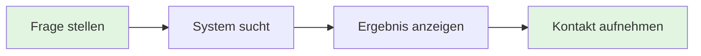

# MCP Server Best Practices für Educational Knowledge Management
## HTL Leonding Diplomarbeit - Comprehensive Guide

**Version:** 1.0  
**Datum:** Januar 2026  
**Autoren:** HTL Leonding - Abteilung Informatik  
**Projekt:** Leowiki MCP Server

---

## Executive Summary

Dieses Dokument beschreibt die Best Practices für die Entwicklung, Implementierung und den Betrieb eines Model Context Protocol (MCP) Servers im Bildungskontext. Der Fokus liegt auf drei Säulen: **Usability**, **Professionalität** und **Sicherheit**.

Der Leowiki MCP Server ermöglicht es Lehrern und Schülern der HTL Leonding, über natürlichsprachliche Anfragen auf die umfangreiche Wissensdatenbank der Schule zuzugreifen. Dabei werden modernste Technologien wie Vector Databases (Qdrant), Semantic Search und Large Language Models kombiniert.

**Kernziele:**
- Nahtlose Integration in den Schulalltag
- Professionelle User Experience ohne technische Barrieren
- DSGVO-konforme Datenverwaltung
- Skalierbare und wartbare Architektur
- State-of-the-art AI-Integration

---

## Inhaltsverzeichnis

1. [Einleitung und Kontext](#1-einleitung-und-kontext)
2. [User Experience Design](#2-user-experience-design)
3. [Technische Architektur](#3-technische-architektur)
4. [Response Formatting & Presentation](#4-response-formatting--presentation)
5. [Sicherheit und Datenschutz](#5-sicherheit-und-datenschutz)
6. [Authentifizierung und Autorisierung](#6-authentifizierung-und-autorisierung)
7. [Best Practices für MCP Tool Design](#7-best-practices-für-mcp-tool-design)
8. [Testing und Quality Assurance](#8-testing-und-quality-assurance)
9. [Performance und Skalierbarkeit](#9-performance-und-skalierbarkeit)
10. [Deployment und Operations](#10-deployment-und-operations)
11. [Monitoring und Logging](#11-monitoring-und-logging)
12. [Dokumentation und Wartung](#12-dokumentation-und-wartung)
13. [Future Work und Erweiterungen](#13-future-work-und-erweiterungen)
14. [Appendix](#14-appendix)

---

## 1. Einleitung und Kontext

### 1.1 Problemstellung

Schulen generieren täglich große Mengen an Informationen: Stundenpläne, Lehrpläne, Projektdokumentationen, Hausordnungen, Kontaktdaten und vieles mehr. Diese Informationen sind oft über verschiedene Systeme verteilt (Wiki, Fileserver, E-Mail, etc.) und für Nutzer schwer auffindbar.

**Herausforderungen:**
- Informationen sind schwer auffindbar
- Verschiedene Formate und Speicherorte
- Zeitaufwändige manuelle Suche
- Barriere für neue Schüler und Lehrer
- Veraltete oder inkonsistente Informationen

### 1.2 Lösungsansatz

Der Leowiki MCP Server nutzt moderne AI-Technologie, um einen intelligenten Zugang zur Wissensdatenbank zu schaffen. Nutzer können in natürlicher Sprache Fragen stellen und erhalten präzise, kontextbezogene Antworten.

**Technologie-Stack:**
- **MCP (Model Context Protocol):** Standardisiertes Protokoll für AI-Tool-Integration
- **FastMCP (Python):** Framework für schnelle MCP-Server-Entwicklung
- **Qdrant:** Vector Database für semantische Suche
- **Sentence Transformers:** Embedding-Modelle für deutsche Texte
- **Claude AI:** Large Language Model als User Interface
- **OAuth 2.0:** Sichere Authentifizierung

### 1.3 Zielgruppen

**Primäre Nutzer:**
- **Schüler:** Suchen nach Unterrichtsmaterialien, Kontakten, Terminen
- **Lehrer:** Benötigen schnellen Zugriff auf Curricula, Schülerdaten, Organisatorisches
- **Administration:** Verwaltung und Pflege der Wissensdatenbank

**Use Cases:**
- "Wer ist mein Klassenvorstand?"
- "Wann ist der nächste Elternabend?"
- "Welche Lehrer unterrichten Programmieren in der 3AHIF?"
- "Wo finde ich die Hausordnung?"
- "Was ist die E-Mail-Adresse des Abteilungsvorstands?"

---

## 2. User Experience Design

### 2.1 UX-Prinzipien

#### Prinzip 1: Invisible Technology
Der technische Stack soll für Endnutzer **unsichtbar** sein. Niemand sollte merken, dass eine Vector Database, Embeddings oder Semantic Search im Hintergrund läuft.

**❌ Schlecht:**
```
Der Leowiki-MCP-Konnektor hat 5 relevante Ergebnisse gefunden, 
alle mit guten Relevanzscores (um 0.4), und die Quellen stammen 
direkt aus dem HTL Leonding Wiki.
```

**✅ Gut:**
```
Professor Bauer ist Abteilungsvorstand im IT-Bereich und als 
Klassenvorstand tätig. Du erreichst ihn unter p.bauer@htl-leonding.ac.at.
```

#### Prinzip 2: Natural Language First
Nutzer kommunizieren in ihrer natürlichen Sprache (Deutsch), nicht in Datenbankabfragen oder technischen Begriffen.

#### Prinzip 3: Context Awareness
Das System versteht den Kontext der Anfrage und liefert relevante Antworten basierend auf der Rolle des Nutzers (Schüler vs. Lehrer).

#### Prinzip 4: Minimal Friction
Jede Interaktion soll so einfach wie möglich sein. Keine unnötigen Schritte, keine komplexen Authentifizierungsprozesse.

#### Prinzip 5: Trust Through Transparency
Quellen werden angegeben, aber dezent. Nutzer sollen nachvollziehen können, woher die Information stammt.

### 2.2 Information Architecture

**Informationshierarchie:**
1. **Direkte Antwort** auf die Frage (Hauptfokus)
2. **Kontext und Details** bei Bedarf
3. **Quellenangabe** (minimal, am Ende)
4. **Weiterführende Informationen** (optional)

**Beispiel:**
```
Frage: "Wer ist Professor Bauer?"

Antwort:
Professor Peter Bauer ist Abteilungsvorstand im IT-Bereich der HTL Leonding.
[Direkte Antwort - Prio 1]

Er ist außerdem als Klassenvorstand tätig und betreut die 1AHIF.
[Kontext - Prio 2]

Kontakt: p.bauer@htl-leonding.ac.at
[Details - Prio 2]

(Quelle: Elternabend-Unterlagen 2024)
[Quellenangabe - Prio 3]
```

### 2.3 Response Design Patterns

#### Pattern 1: Person Information
```python
# Template für Personen-Anfragen
{
    "name": "Prof. [Name]",
    "position": "[Rolle/Funktion]",
    "contact": "[E-Mail]",
    "additional_info": "[Weitere Details]",
    "source": "(Quelle: [Dokumenttyp])"
}
```

#### Pattern 2: Schedule/Events
```python
# Template für Termin-Anfragen
{
    "event": "[Veranstaltungsname]",
    "date": "[Datum/Zeit]",
    "location": "[Ort]",
    "participants": "[Zielgruppe]",
    "source": "(Quelle: [Dokumenttyp])"
}
```

#### Pattern 3: Educational Content
```python
# Template für Unterrichtsinhalte
{
    "subject": "[Gegenstand]",
    "topic": "[Thema]",
    "description": "[Beschreibung]",
    "teachers": "[Lehrer]",
    "resources": "[Materialien]",
    "source": "(Quelle: [Dokumenttyp])"
}
```

#### Pattern 4: Not Found / No Results
```python
# Wenn keine Ergebnisse gefunden werden
"""
Ich konnte leider keine Informationen zu [Thema] im Wiki finden.

Mögliche Gründe:
- Die Information ist noch nicht dokumentiert
- Die Suche war zu spezifisch
- Das Dokument wurde noch nicht indexiert

Kann ich dir bei etwas anderem helfen?
"""
```

### 2.4 Persona-basiertes Design

#### Persona 1: Anna (Schülerin, 16 Jahre, 2AHIF)
**Bedürfnisse:**
- Schnelle Antworten auf einfache Fragen
- Kontaktdaten von Lehrern
- Termine und Fristen
- Unterrichtsmaterialien

**Anforderungen an Antworten:**
- Kurz und prägnant
- Einfache Sprache
- Praktische Informationen im Fokus

#### Persona 2: Mag. Müller (Lehrer, 45 Jahre, Programmieren)
**Bedürfnisse:**
- Detaillierte Informationen zu Lehrplänen
- Schülerdaten (mit entsprechenden Berechtigungen)
- Administrative Prozesse
- Kollegenkontakte

**Anforderungen an Antworten:**
- Präzise und vollständig
- Professionelle Sprache
- Quellenangaben wichtig

#### Persona 3: Direktion (Administration)
**Bedürfnisse:**
- Umfassende Übersichten
- Statistische Daten
- Organisatorische Informationen
- Compliance und Rechtliches

**Anforderungen an Antworten:**
- Sehr detailliert
- Formell
- Vollständige Quellenangaben
- Rechtssichere Formulierungen

### 2.5 User Journey Mapping

#### Journey 1: Neue Schülerin sucht Klassenvorstand



**Interaktion:**
```
User: "Wer ist mein Klassenvorstand? Ich bin in der 1AHIF."

System: "Dein Klassenvorstand ist Professor Peter Bauer. 
Du kannst ihn unter p.bauer@htl-leonding.ac.at erreichen."

User: "Danke!"
```

**Erfolgsmetriken:**
- Zeit bis zur Antwort: < 3 Sekunden
- Antwort vollständig: Ja
- Zusätzliche Fragen nötig: Nein
- User Satisfaction: Hoch

---

## 3. Technische Architektur

### 3.1 System-Übersicht

```
┌─────────────────────────────────────────────────────────────┐
│                         End Users                            │
│              (Schüler, Lehrer, Administration)              │
└─────────────────┬───────────────────────────────────────────┘
                  │
                  ▼
┌─────────────────────────────────────────────────────────────┐
│                      Claude AI (UI)                          │
│              (Natural Language Interface)                    │
└─────────────────┬───────────────────────────────────────────┘
                  │
                  │ MCP Protocol (SSE/HTTP)
                  │
                  ▼
┌─────────────────────────────────────────────────────────────┐
│                   Leowiki MCP Server                         │
│  ┌──────────────────────────────────────────────────────┐   │
│  │  Tool Layer                                          │   │
│  │  - search_content()                                  │   │
│  │  - health_check()                                    │   │
│  └──────────────┬───────────────────────────────────────┘   │
│                 │                                            │
│  ┌──────────────▼───────────────────────────────────────┐   │
│  │  Business Logic Layer                                │   │
│  │  - Query Processing                                  │   │
│  │  - Response Formatting                               │   │
│  │  - Access Control (RBAC)                             │   │
│  └──────────────┬───────────────────────────────────────┘   │
│                 │                                            │
│  ┌──────────────▼───────────────────────────────────────┐   │
│  │  Data Access Layer                                   │   │
│  │  - Qdrant Client                                     │   │
│  │  - Embedding Service                                 │   │
│  └──────────────┬───────────────────────────────────────┘   │
└─────────────────┼───────────────────────────────────────────┘
                  │
                  ▼
┌─────────────────────────────────────────────────────────────┐
│                  Qdrant Vector Database                      │
│  ┌──────────────────────────────────────────────────────┐   │
│  │  Collections:                                        │   │
│  │  - htl_leonding_wiki (768 dimensions)               │   │
│  │  - teacher_contacts                                  │   │
│  │  - curriculum_documents                              │   │
│  └──────────────────────────────────────────────────────┘   │
└─────────────────────────────────────────────────────────────┘
```

### 3.2 Komponenten-Beschreibung

#### 3.2.1 MCP Server (FastMCP)
- **Sprache:** Python 3.11+
- **Framework:** FastMCP (auf Basis von FastAPI)
- **Protokoll:** MCP via Server-Sent Events (SSE)
- **Deployment:** Streamable HTTP Endpoint

**Hauptaufgaben:**
- MCP-Protokoll-Handling
- Tool-Registrierung und -Ausführung
- Request/Response-Transformation
- Error Handling und Logging

#### 3.2.2 Vector Database (Qdrant)
- **Version:** Qdrant 1.7+
- **Deployment:** Docker Container oder Cloud
- **Persistence:** Disk-based Storage
- **Backup:** Automated Snapshots

**Konfiguration:**
```python
QDRANT_CONFIG = {
    "collection_name": "htl_leonding_wiki",
    "vector_size": 768,  # distiluse-base-multilingual-cased-v2
    "distance": "Cosine",
    "on_disk_payload": True,  # Für große Datasets
    "quantization": {
        "type": "scalar",  # Reduziert Memory Footprint
        "quantile": 0.99
    }
}
```

#### 3.2.3 Embedding Service
- **Modell:** `distiluse-base-multilingual-cased-v2`
- **Alternative:** `paraphrase-multilingual-MiniLM-L12-v2`
- **Framework:** Sentence Transformers

**Begründung der Modellwahl:**
- Optimiert für deutsche Sprache
- Gute Performance bei semantischer Ähnlichkeit
- Moderate Größe (768 Dimensionen)
- Schnelle Inferenz

### 3.3 Datenfluss

#### 3.3.1 Query Processing Flow

```
1. User Query (Claude)
   "Wer ist Professor Bauer?"
   │
   ▼
2. MCP Request
   {
     "tool": "search_content",
     "arguments": {"query": "Professor Bauer", "limit": 5}
   }
   │
   ▼
3. Embedding Generation
   query_vector = embed("Professor Bauer")  # [0.23, -0.45, ...]
   │
   ▼
4. Vector Search (Qdrant)
   results = qdrant.search(
     collection="htl_leonding_wiki",
     query_vector=query_vector,
     limit=5,
     score_threshold=0.3
   )
   │
   ▼
5. Access Control Check
   filtered_results = rbac_filter(results, user_role="student")
   │
   ▼
6. Response Formatting
   formatted = format_user_friendly(filtered_results)
   │
   ▼
7. MCP Response
   {
     "content": [{
       "type": "text",
       "text": "Professor Bauer ist Abteilungsvorstand..."
     }]
   }
   │
   ▼
8. Claude Presentation
   Natural language response to user
```

### 3.4 Data Model

#### 3.4.1 Qdrant Document Structure

```python
class WikiDocument:
    """Struktur eines indexierten Dokuments"""
    
    id: str  # Unique identifier
    vector: List[float]  # 768-dimensional embedding
    
    payload: {
        # Content
        "content": str,  # Der eigentliche Text
        "title": str,
        "summary": str,
        
        # Metadata
        "source_url": str,
        "document_type": str,  # "wiki", "pdf", "pptx", "docx"
        "created_at": datetime,
        "updated_at": datetime,
        
        # Classification
        "category": str,  # "teacher_info", "schedule", "curriculum", ...
        "tags": List[str],
        
        # Access Control
        "access_level": str,  # "public", "student", "teacher", "admin"
        "restricted_to": List[str],  # Specific user groups
        
        # Searchability
        "language": "de",
        "chunk_id": int,  # For large documents split into chunks
        "parent_document_id": str
    }
```

#### 3.4.2 Access Levels

```python
class AccessLevel(Enum):
    PUBLIC = "public"      # Alle (auch externe)
    STUDENT = "student"    # Alle Schüler
    TEACHER = "teacher"    # Alle Lehrer
    ADMIN = "admin"        # Nur Administration
    RESTRICTED = "restricted"  # Spezifische Gruppen
```

---

## 4. Response Formatting & Presentation

### 4.1 Formatierungs-Philosophie

**Kernprinzip:** "Answer First, Details Second, Metadata Last"

### 4.2 Response Formatter Implementation

```python
class ResponseFormatter:
    """
    Formatiert Qdrant-Suchergebnisse in nutzerfreundliche Antworten
    """
    
    def __init__(self):
        self.min_score = 0.3  # Minimum relevance score
        self.max_results = 3  # Maximum results to include
        
    def format_search_results(
        self, 
        results: List[ScoredPoint],
        query: str,
        user_role: str
    ) -> str:
        """
        Hauptfunktion zur Formatierung von Suchergebnissen
        
        Args:
            results: Qdrant search results mit scores
            query: Original user query
            user_role: Role of requesting user (for personalization)
            
        Returns:
            Nutzerfreundlich formatierter String
        """
        
        # No results handling
        if not results:
            return self._format_no_results(query)
        
        # Filter by score threshold
        relevant_results = [
            r for r in results 
            if r.score >= self.min_score
        ]
        
        if not relevant_results:
            return self._format_no_results(query)
        
        # Detect query type
        query_type = self._detect_query_type(query)
        
        # Format based on type
        if query_type == "person":
            return self._format_person_info(relevant_results)
        elif query_type == "schedule":
            return self._format_schedule_info(relevant_results)
        elif query_type == "content":
            return self._format_content_info(relevant_results)
        else:
            return self._format_generic_info(relevant_results)
    
    def _detect_query_type(self, query: str) -> str:
        """Erkennt die Art der Anfrage basierend auf Keywords"""
        query_lower = query.lower()
        
        person_keywords = ["wer", "professor", "lehrer", "direktor", "kontakt"]
        schedule_keywords = ["wann", "termin", "elternabend", "sprechstunde"]
        
        if any(kw in query_lower for kw in person_keywords):
            return "person"
        elif any(kw in query_lower for kw in schedule_keywords):
            return "schedule"
        else:
            return "content"
    
    def _format_person_info(self, results: List[ScoredPoint]) -> str:
        """Formatiert Personen-Informationen"""
        # Extract person data from top result
        top_result = results[0]
        payload = top_result.payload
        
        # Parse content for structured data
        person_data = self._extract_person_data(payload['content'])
        
        # Build response
        response_parts = []
        
        # Name and title
        if person_data.get('name'):
            response_parts.append(f"**{person_data['name']}**")
        
        # Position/Role
        if person_data.get('position'):
            response_parts.append(f"{person_data['position']}")
        
        # Contact
        if person_data.get('email'):
            response_parts.append(f"Kontakt: {person_data['email']}")
        
        # Additional info
        if person_data.get('additional'):
            response_parts.append(f"\n{person_data['additional']}")
        
        # Source (minimal)
        source = self._format_source(payload['source_url'])
        response_parts.append(f"\n(Quelle: {source})")
        
        return "\n".join(response_parts)
    
    def _extract_person_data(self, content: str) -> Dict[str, str]:
        """
        Extrahiert strukturierte Personen-Daten aus Fließtext
        Verwendet Regex und NLP-Techniken
        """
        person_data = {}
        
        # E-Mail Regex
        email_pattern = r'\b[A-Za-z0-9._%+-]+@htl-leonding\.ac\.at\b'
        email_match = re.search(email_pattern, content)
        if email_match:
            person_data['email'] = email_match.group(0)
        
        # Position Keywords
        positions = ["Abteilungsvorstand", "Klassenvorstand", "Direktor", "Professor"]
        for pos in positions:
            if pos.lower() in content.lower():
                person_data['position'] = pos
                break
        
        # Name extraction (simplified - würde in Produktion NER nutzen)
        # Hier: Suche nach "Prof. [Name]" oder "[Name] ist"
        name_pattern = r'(?:Prof\.|Professor)\s+([A-Z][a-z]+(?:\s+[A-Z][a-z]+)?)'
        name_match = re.search(name_pattern, content)
        if name_match:
            person_data['name'] = f"Prof. {name_match.group(1)}"
        
        return person_data
    
    def _format_source(self, source_url: str) -> str:
        """
        Wandelt technische URLs in nutzerfreundliche Quellenangaben um
        """
        source_mapping = {
            'elternabend': 'Elternabend-Unterlagen',
            'handbuch': 'Schülerhandbuch',
            'lehrplan': 'Lehrplan',
            'stundenplan': 'Stundenplan',
            'kontakte': 'Kontaktliste'
        }
        
        url_lower = source_url.lower()
        for key, friendly_name in source_mapping.items():
            if key in url_lower:
                return friendly_name
        
        return "HTL Leonding Wiki"
    
    def _format_no_results(self, query: str) -> str:
        """Freundliche Nachricht wenn keine Ergebnisse gefunden wurden"""
        return f"""Ich konnte leider keine passenden Informationen zu "{query}" finden.

Mögliche Gründe:
- Die Information ist noch nicht im Wiki dokumentiert
- Die Suche war zu spezifisch
- Das Dokument wurde noch nicht indexiert

Kann ich dir bei etwas anderem helfen? Du kannst auch direkt auf der Wiki-Seite suchen: https://leowiki.htl-leonding.ac.at"""
```

### 4.3 Claude-Seitige Instructions

Um sicherzustellen, dass Claude die Ergebnisse optimal präsentiert, sollten klare Instruktionen im Tool selbst enthalten sein:

```python
@mcp.tool()
async def search_content(
    query: str,
    limit: int = 10,
    access_level: str = "student"
) -> str:
    """
    Search educational content with semantic search and RBAC filtering.
    
    WICHTIGE INSTRUKTIONEN FÜR CLAUDE:
    
    1. PRÄSENTATION:
       - Präsentiere Ergebnisse natürlich und direkt
       - NIEMALS technische Details wie Scores, Result-Counts oder Datenbankinfo erwähnen
       - Fokus auf den INHALT der Antwort, nicht die Mechanik
    
    2. STIL:
       - Kurze, präzise Antworten
       - Freundlicher aber professioneller Ton
       - Anpassung an Zielgruppe (Schüler vs. Lehrer)
    
    3. QUELLEN:
       - Nur am Ende, in Klammern
       - Format: "(Quelle: [Dokumenttyp])"
       - NICHT: Lange URLs oder technische Pfade
    
    4. FEHLERBEHANDLUNG:
       - Bei keinen Ergebnissen: Freundlich erklären, Alternativen anbieten
       - NICHT: "Der Server hat 0 Ergebnisse zurückgegeben"
       - SONDERN: "Ich konnte leider keine Informationen dazu finden"
    
    5. BEISPIELE:
    
       SCHLECHT:
       "Ich habe den Leowiki-Server abgefragt und 3 Ergebnisse mit Scores
       zwischen 0.4 und 0.6 erhalten. Result 1 (score: 0.45) zeigt..."
       
       GUT:
       "Professor Bauer ist Abteilungsvorstand im IT-Bereich. 
       Du erreichst ihn unter p.bauer@htl-leonding.ac.at."
    
    Args:
        query: Search query in natural language (German)
        limit: Maximum number of results (default: 10)
        access_level: User access level (student/teacher/admin)
    
    Returns:
        Formatted search results optimized for end-user presentation
    """
    # Implementation...
```

### 4.4 Response Templates

#### Template: Person Information
```python
TEMPLATE_PERSON = """**{name}**

{position}
{additional_roles}

Kontakt: {email}
{phone}

{additional_info}

(Quelle: {source})
"""
```

#### Template: Schedule/Event
```python
TEMPLATE_EVENT = """**{event_name}**

Datum: {date}
Zeit: {time}
Ort: {location}

{description}

Zielgruppe: {target_audience}

(Quelle: {source})
"""
```

#### Template: Educational Content
```python
TEMPLATE_CONTENT = """**{subject} - {topic}**

{description}

Lehrer: {teachers}
Wochenstunden: {hours_per_week}

{additional_info}

(Quelle: {source})
"""
```

---

## 5. Sicherheit und Datenschutz

### 5.1 DSGVO-Compliance

#### 5.1.1 Rechtliche Grundlagen

Der Leowiki MCP Server verarbeitet personenbezogene Daten von Schülern und Lehrern. Daher muss er den Anforderungen der DSGVO (Datenschutz-Grundverordnung) entsprechen.

**Betroffene Datenarten:**
- Namen von Schülern und Lehrern
- E-Mail-Adressen
- Telefonnummern
- Klassenzugehörigkeiten
- Leistungsdaten (bei Erweiterungen)
- Anwesenheitsdaten

**Rechtliche Basis:**
- Art. 6 Abs. 1 lit. e DSGVO: Öffentliches Interesse (Bildungsauftrag)
- Art. 9 Abs. 2 lit. g DSGVO: Besondere Kategorien (bei Gesundheitsdaten)
- § 4 DSG (österreichisches Datenschutzgesetz)

#### 5.1.2 Datenschutz-Prinzipien

**1. Datensparsamkeit (Data Minimization)**
```python
# Nur notwendige Felder indexieren
ALLOWED_FIELDS = {
    "name": True,          # Notwendig für Identifikation
    "email": True,         # Notwendig für Kontakt
    "position": True,      # Notwendig für Kontext
    "private_phone": False,  # NICHT indexieren
    "home_address": False,   # NICHT indexieren
    "salary": False          # NICHT indexieren
}
```

**2. Zweckbindung (Purpose Limitation)**
```python
# Daten nur für dokumentierte Zwecke nutzen
ALLOWED_PURPOSES = [
    "contact_information",  # Kontaktdaten abrufbar machen
    "organizational_info",  # Organisatorische Infos
    "educational_content"   # Lehrmaterialien
]

# Explizit verboten:
FORBIDDEN_PURPOSES = [
    "marketing",
    "profiling",
    "automated_decision_making"
]
```

**3. Speicherbegrenzung (Storage Limitation)**
```python
class DataRetentionPolicy:
    """Löschfristen für verschiedene Datenarten"""
    
    RETENTION_PERIODS = {
        "student_data": {
            "during_enrollment": None,  # Unbegrenzt während Schulbesuch
            "after_graduation": 365 * 2,  # 2 Jahre nach Abschluss
            "deletion_method": "hard_delete"
        },
        "teacher_data": {
            "during_employment": None,
            "after_leaving": 365 * 5,  # 5 Jahre nach Ausscheiden
            "deletion_method": "anonymize"
        },
        "logs": {
            "retention_days": 90,  # 90 Tage Log-Aufbewahrung
            "deletion_method": "hard_delete"
        }
    }
```

**4. Integrität und Vertraulichkeit**
```python
# Verschlüsselung sensitiver Daten
class DataEncryption:
    def __init__(self):
        self.key = Fernet.generate_key()
        self.cipher = Fernet(self.key)
    
    def encrypt_sensitive_field(self, data: str) -> str:
        """Verschlüsselt sensitive Daten vor Speicherung"""
        return self.cipher.encrypt(data.encode()).decode()
    
    def decrypt_sensitive_field(self, encrypted: str) -> str:
        """Entschlüsselt Daten bei Abruf"""
        return self.cipher.decrypt(encrypted.encode()).decode()
```

#### 5.1.3 Betroffenenrechte

**Implementation der DSGVO-Rechte:**

```python
class DataSubjectRights:
    """
    Implementierung der Betroffenenrechte nach DSGVO
    """
    
    async def right_of_access(self, user_id: str) -> Dict:
        """
        Art. 15 DSGVO: Auskunftsrecht
        
        Nutzer kann alle über ihn gespeicherten Daten abfragen
        """
        user_data = await self.get_all_user_data(user_id)
        return {
            "personal_data": user_data,
            "processing_purposes": self.get_purposes(),
            "recipients": self.get_data_recipients(),
            "retention_period": self.get_retention_period(user_id),
            "rights": self.list_data_subject_rights()
        }
    
    async def right_to_erasure(self, user_id: str) -> bool:
        """
        Art. 17 DSGVO: Recht auf Löschung ("Recht auf Vergessenwerden")
        
        Nutzer kann Löschung seiner Daten verlangen
        """
        # Prüfe ob Löschung zulässig (keine gesetzliche Aufbewahrungspflicht)
        if await self.has_legal_retention_requirement(user_id):
            raise LegalRetentionException(
                "Daten unterliegen gesetzlicher Aufbewahrungspflicht"
            )
        
        # Hard Delete aus Vector DB
        await qdrant_client.delete(
            collection_name="htl_leonding_wiki",
            points_selector=FilterSelector(
                filter=Filter(
                    must=[
                        FieldCondition(
                            key="user_id",
                            match=MatchValue(value=user_id)
                        )
                    ]
                )
            )
        )
        
        # Lösche aus Backups (WICHTIG!)
        await self.delete_from_backups(user_id)
        
        # Logging (anonymisiert)
        logger.info(f"User data deleted per GDPR request: {hash(user_id)}")
        
        return True
    
    async def right_to_rectification(
        self, 
        user_id: str, 
        corrections: Dict
    ) -> bool:
        """
        Art. 16 DSGVO: Recht auf Berichtigung
        
        Nutzer kann falsche Daten korrigieren lassen
        """
        # Update in Vector DB
        await self.update_user_data(user_id, corrections)
        
        # Audit Log
        await self.log_rectification(user_id, corrections)
        
        return True
    
    async def right_to_data_portability(self, user_id: str) -> bytes:
        """
        Art. 20 DSGVO: Recht auf Datenübertragbarkeit
        
        Nutzer kann seine Daten in maschinenlesbarem Format erhalten
        """
        user_data = await self.get_all_user_data(user_id)
        
        # Export als JSON
        export_data = {
            "metadata": {
                "export_date": datetime.now().isoformat(),
                "format_version": "1.0",
                "user_id": user_id
            },
            "data": user_data
        }
        
        return json.dumps(export_data, indent=2).encode()
```

### 5.2 Access Control und RBAC

#### 5.2.1 Role-Based Access Control (RBAC)

```python
class Role(Enum):
    """Rollen-Definition für RBAC"""
    PUBLIC = "public"          # Öffentlich zugänglich
    STUDENT = "student"        # Reguläre Schüler
    TEACHER = "teacher"        # Lehrer
    CLASS_TEACHER = "class_teacher"  # Klassenvorstand (erweiterte Rechte)
    ADMIN = "admin"            # Administration
    DIRECTOR = "director"      # Direktion (volle Rechte)

class Permission(Enum):
    """Granulare Berechtigungen"""
    READ_PUBLIC = "read:public"
    READ_STUDENT_DATA = "read:student_data"
    READ_TEACHER_DATA = "read:teacher_data"
    READ_GRADES = "read:grades"
    READ_SENSITIVE = "read:sensitive"
    WRITE_CONTENT = "write:content"
    DELETE_CONTENT = "delete:content"
    MANAGE_USERS = "manage:users"

class RBACPolicy:
    """Definition der Rollen-Berechtigungs-Matrix"""
    
    ROLE_PERMISSIONS = {
        Role.PUBLIC: [
            Permission.READ_PUBLIC
        ],
        Role.STUDENT: [
            Permission.READ_PUBLIC,
            Permission.READ_STUDENT_DATA  # Nur eigene Daten
        ],
        Role.TEACHER: [
            Permission.READ_PUBLIC,
            Permission.READ_STUDENT_DATA,
            Permission.READ_TEACHER_DATA,
            Permission.WRITE_CONTENT
        ],
        Role.CLASS_TEACHER: [
            Permission.READ_PUBLIC,
            Permission.READ_STUDENT_DATA,
            Permission.READ_TEACHER_DATA,
            Permission.READ_GRADES,  # Noten der eigenen Klasse
            Permission.WRITE_CONTENT
        ],
        Role.ADMIN: [
            Permission.READ_PUBLIC,
            Permission.READ_STUDENT_DATA,
            Permission.READ_TEACHER_DATA,
            Permission.READ_GRADES,
            Permission.READ_SENSITIVE,
            Permission.WRITE_CONTENT,
            Permission.DELETE_CONTENT,
            Permission.MANAGE_USERS
        ],
        Role.DIRECTOR: list(Permission)  # Alle Berechtigungen
    }
```

#### 5.2.2 RBAC Enforcement

```python
class RBACEnforcer:
    """
    Erzwingt Access Control bei allen Operationen
    """
    
    def __init__(self, rbac_policy: RBACPolicy):
        self.policy = rbac_policy
    
    async def filter_search_results(
        self,
        results: List[ScoredPoint],
        user: User
    ) -> List[ScoredPoint]:
        """
        Filtert Suchergebnisse basierend auf Nutzerberechtigungen
        """
        filtered_results = []
        
        for result in results:
            if await self.can_access(user, result):
                # Entferne sensitive Felder wenn keine Berechtigung
                sanitized = await self.sanitize_result(result, user)
                filtered_results.append(sanitized)
        
        return filtered_results
    
    async def can_access(
        self, 
        user: User, 
        document: ScoredPoint
    ) -> bool:
        """
        Prüft ob Nutzer auf Dokument zugreifen darf
        """
        doc_access_level = document.payload.get("access_level")
        user_role = user.role
        
        # Public documents: alle dürfen zugreifen
        if doc_access_level == "public":
            return True
        
        # Student documents: nur Lehrer und höher
        if doc_access_level == "student":
            return user_role in [Role.TEACHER, Role.CLASS_TEACHER, 
                                 Role.ADMIN, Role.DIRECTOR]
        
        # Teacher documents: nur Lehrer untereinander
        if doc_access_level == "teacher":
            return user_role in [Role.TEACHER, Role.CLASS_TEACHER, 
                                 Role.ADMIN, Role.DIRECTOR]
        
        # Sensitive documents: nur Admin und Direktion
        if doc_access_level == "sensitive":
            return user_role in [Role.ADMIN, Role.DIRECTOR]
        
        # Restricted: Prüfe spezifische Gruppen
        if doc_access_level == "restricted":
            allowed_groups = document.payload.get("restricted_to", [])
            return user.group_id in allowed_groups
        
        return False
    
    async def sanitize_result(
        self,
        result: ScoredPoint,
        user: User
    ) -> ScoredPoint:
        """
        Entfernt sensitive Felder aus Ergebnis basierend auf Rolle
        """
        payload = result.payload.copy()
        
        # Schüler dürfen keine Kontaktdaten von anderen Schülern sehen
        if user.role == Role.STUDENT:
            if payload.get("entity_type") == "student":
                if payload.get("user_id") != user.id:
                    payload.pop("email", None)
                    payload.pop("phone", None)
        
        # Nur Klassenvorstand darf Noten der eigenen Klasse sehen
        if user.role == Role.CLASS_TEACHER:
            if payload.get("content_type") == "grade":
                student_class = payload.get("student_class")
                if student_class != user.managed_class:
                    return None  # Filter out completely
        
        result.payload = payload
        return result
```

### 5.3 Audit Logging

```python
class AuditLogger:
    """
    Compliance-konformes Audit-Logging
    """
    
    def __init__(self):
        self.log_retention_days = 90  # DSGVO-konform
    
    async def log_access(
        self,
        user: User,
        action: str,
        resource: str,
        success: bool,
        details: Optional[Dict] = None
    ):
        """
        Loggt jeden Zugriff auf das System
        """
        log_entry = {
            "timestamp": datetime.now(timezone.utc).isoformat(),
            "user_id": hash(user.id),  # Pseudonymisiert
            "user_role": user.role.value,
            "action": action,
            "resource": resource,
            "success": success,
            "ip_address": self._hash_ip(user.ip_address),  # Pseudonymisiert
            "details": details or {}
        }
        
        # Schreibe in separates Audit-Log
        await self.write_audit_log(log_entry)
        
        # Bei sensitiven Zugriffen: Alert an Admin
        if self._is_sensitive_access(action, resource):
            await self.alert_admin(log_entry)
    
    async def log_data_access(
        self,
        user: User,
        accessed_data: Dict
    ):
        """
        Spezielles Logging für Zugriffe auf personenbezogene Daten
        """
        await self.log_access(
            user=user,
            action="data_access",
            resource=accessed_data.get("type"),
            success=True,
            details={
                "accessed_fields": list(accessed_data.keys()),
                "data_subject_id": hash(accessed_data.get("user_id")),
                "purpose": "search_query"
            }
        )
```

### 5.4 Security Best Practices

#### 5.4.1 Input Validation

```python
class InputValidator:
    """
    Validiert und sanitized alle User Inputs
    """
    
    MAX_QUERY_LENGTH = 500
    ALLOWED_CHARACTERS = re.compile(r'^[a-zA-ZäöüÄÖÜß0-9\s\-.,!?]+$')
    
    @staticmethod
    def validate_search_query(query: str) -> str:
        """
        Validiert Suchanfragen gegen Injection-Angriffe
        """
        # Length check
        if len(query) > InputValidator.MAX_QUERY_LENGTH:
            raise ValidationError(
                f"Query too long (max {InputValidator.MAX_QUERY_LENGTH} chars)"
            )
        
        # Character whitelist
        if not InputValidator.ALLOWED_CHARACTERS.match(query):
            raise ValidationError("Query contains invalid characters")
        
        # SQL Injection patterns (falls direkte DB-Zugriffe)
        dangerous_patterns = [
            r'(\b(union|select|insert|update|delete|drop)\b)',
            r'(--|;|\/\*|\*\/)',
            r'(\bor\b.*=.*)'
        ]
        
        query_lower = query.lower()
        for pattern in dangerous_patterns:
            if re.search(pattern, query_lower):
                raise SecurityError("Potential SQL injection detected")
        
        return query.strip()
```

#### 5.4.2 Rate Limiting

```python
from slowapi import Limiter
from slowapi.util import get_remote_address

class RateLimiter:
    """
    Rate Limiting zum Schutz vor Abuse
    """
    
    def __init__(self):
        self.limiter = Limiter(key_func=get_remote_address)
    
    @limiter.limit("100/hour")  # 100 requests pro Stunde
    async def search_endpoint(self, request: Request):
        """Rate-limited search endpoint"""
        pass
    
    @limiter.limit("10/minute")  # 10 requests pro Minute für sensitive Operationen
    async def admin_endpoint(self, request: Request):
        """Rate-limited admin endpoint"""
        pass
```

#### 5.4.3 Secrets Management

```python
import os
from cryptography.fernet import Fernet

class SecretsManager:
    """
    Sichere Verwaltung von Credentials und API Keys
    """
    
    @staticmethod
    def load_secret(secret_name: str) -> str:
        """
        Lädt Secrets aus sicheren Quellen (niemals Plaintext!)
        """
        # Option 1: Environment Variables
        if secret := os.getenv(secret_name):
            return secret
        
        # Option 2: Secrets Manager (AWS, Azure, etc.)
        # secret = aws_secrets_manager.get_secret(secret_name)
        
        # Option 3: Encrypted Config File
        # secret = load_encrypted_config(secret_name)
        
        raise ValueError(f"Secret '{secret_name}' not found")
    
    @staticmethod
    def encrypt_at_rest(data: str, key: bytes) -> bytes:
        """Verschlüsselt Daten für Speicherung"""
        f = Fernet(key)
        return f.encrypt(data.encode())
```

---

## 6. Authentifizierung und Autorisierung

### 6.1 OAuth 2.0 Integration

```python
from authlib.integrations.starlette_client import OAuth

class AuthenticationManager:
    """
    OAuth 2.0 Authentifizierung für HTL Leonding
    """
    
    def __init__(self):
        self.oauth = OAuth()
        self.oauth.register(
            name='htl_leonding',
            client_id=os.getenv('OAUTH_CLIENT_ID'),
            client_secret=os.getenv('OAUTH_CLIENT_SECRET'),
            server_metadata_url='https://auth.htl-leonding.ac.at/.well-known/openid-configuration',
            client_kwargs={'scope': 'openid profile email'}
        )
    
    async def login(self, redirect_uri: str):
        """Initiiert OAuth Login Flow"""
        return await self.oauth.htl_leonding.authorize_redirect(redirect_uri)
    
    async def callback(self, request):
        """Verarbeitet OAuth Callback"""
        token = await self.oauth.htl_leonding.authorize_access_token(request)
        user_info = token.get('userinfo')
        
        # Erstelle oder update User
        user = await self.get_or_create_user(user_info)
        
        # Erstelle Session
        session = await self.create_session(user)
        
        return session
    
    async def get_or_create_user(self, user_info: Dict) -> User:
        """Erstellt User aus OAuth Daten"""
        email = user_info.get('email')
        
        # Bestimme Rolle basierend auf E-Mail oder Gruppe
        role = self.determine_role(email)
        
        user = User(
            id=user_info.get('sub'),
            email=email,
            name=user_info.get('name'),
            role=role
        )
        
        await self.save_user(user)
        return user
    
    def determine_role(self, email: str) -> Role:
        """Bestimmt Rolle basierend auf E-Mail-Domain/Pattern"""
        if email.endswith('@teacher.htl-leonding.ac.at'):
            return Role.TEACHER
        elif email.endswith('@student.htl-leonding.ac.at'):
            return Role.STUDENT
        elif email.endswith('@admin.htl-leonding.ac.at'):
            return Role.ADMIN
        else:
            return Role.PUBLIC
```

### 6.2 Session Management

```python
from datetime import timedelta
import jwt

class SessionManager:
    """
    Verwaltet User Sessions mit JWT
    """
    
    SESSION_DURATION = timedelta(hours=8)  # Session läuft nach 8h ab
    SECRET_KEY = os.getenv('JWT_SECRET_KEY')
    
    async def create_session(self, user: User) -> str:
        """Erstellt JWT Session Token"""
        payload = {
            'user_id': user.id,
            'email': user.email,
            'role': user.role.value,
            'exp': datetime.now(timezone.utc) + self.SESSION_DURATION,
            'iat': datetime.now(timezone.utc)
        }
        
        token = jwt.encode(payload, self.SECRET_KEY, algorithm='HS256')
        
        # Speichere Session für Revocation
        await self.store_session(user.id, token)
        
        return token
    
    async def validate_session(self, token: str) -> User:
        """Validiert JWT Token und gibt User zurück"""
        try:
            payload = jwt.decode(token, self.SECRET_KEY, algorithms=['HS256'])
            
            # Prüfe ob Session nicht revoked wurde
            if await self.is_session_revoked(payload['user_id'], token):
                raise AuthenticationError("Session has been revoked")
            
            user = await self.load_user(payload['user_id'])
            return user
            
        except jwt.ExpiredSignatureError:
            raise AuthenticationError("Session expired")
        except jwt.InvalidTokenError:
            raise AuthenticationError("Invalid token")
    
    async def revoke_session(self, user_id: str, token: str):
        """Widerruft eine Session (z.B. bei Logout)"""
        await self.mark_session_revoked(user_id, token)
```

---

## 7. Best Practices für MCP Tool Design

### 7.1 Tool Definition Guidelines

#### Regel 1: Klare, beschreibende Namen
```python
# ❌ Schlecht
@mcp.tool()
async def search(q: str): ...

# ✅ Gut
@mcp.tool()
async def search_content(query: str): ...
```

#### Regel 2: Ausführliche Docstrings
```python
@mcp.tool()
async def search_content(
    query: str,
    limit: int = 10,
    access_level: str = "student"
) -> str:
    """
    Search educational content with semantic search and RBAC filtering.
    
    This tool searches the HTL Leonding knowledge base using semantic
    vector search. Results are automatically filtered based on the user's
    access level to ensure data privacy compliance.
    
    Args:
        query: Natural language search query in German
            Example: "Wer ist Professor Bauer?"
        
        limit: Maximum number of results to return (1-20)
            Default: 10
            Higher values may impact performance
        
        access_level: User's access level for RBAC filtering
            Options: "public", "student", "teacher", "admin"
            Default: "student"
    
    Returns:
        Formatted search results as natural language text.
        Returns user-friendly message if no results found.
    
    Examples:
        >>> await search_content("Professor Bauer", limit=5)
        "Professor Peter Bauer ist Abteilungsvorstand..."
        
        >>> await search_content("Elternabend 1AHIF")
        "Der nächste Elternabend findet am..."
    
    Security:
        - All results are filtered by RBAC
        - Sensitive data is automatically sanitized
        - Audit logging is performed
    
    Performance:
        - Typical response time: 100-300ms
        - Uses cached embeddings when possible
    """
```

#### Regel 3: Typsichere Parameter
```python
from pydantic import BaseModel, Field
from typing import Literal

class SearchRequest(BaseModel):
    """Type-safe search request model"""
    query: str = Field(
        ..., 
        min_length=1, 
        max_length=500,
        description="Search query in German"
    )
    limit: int = Field(
        default=10,
        ge=1,
        le=20,
        description="Max number of results"
    )
    access_level: Literal["public", "student", "teacher", "admin"] = Field(
        default="student",
        description="User access level"
    )
```

### 7.2 Error Handling

```python
class MCPError(Exception):
    """Base exception for MCP operations"""
    pass

class ValidationError(MCPError):
    """Input validation failed"""
    pass

class AuthorizationError(MCPError):
    """User not authorized for operation"""
    pass

class ResourceNotFoundError(MCPError):
    """Requested resource not found"""
    pass

@mcp.tool()
async def search_content(query: str) -> str:
    """Search with comprehensive error handling"""
    try:
        # Validate input
        validated_query = InputValidator.validate_search_query(query)
        
        # Perform search
        results = await perform_search(validated_query)
        
        # Format response
        return ResponseFormatter().format_search_results(results)
        
    except ValidationError as e:
        logger.warning(f"Validation error: {e}")
        return f"Entschuldigung, deine Anfrage enthält ungültige Zeichen. Bitte versuche es erneut."
    
    except AuthorizationError as e:
        logger.warning(f"Authorization error: {e}")
        return f"Du hast leider keine Berechtigung für diese Anfrage."
    
    except ResourceNotFoundError as e:
        logger.info(f"Resource not found: {e}")
        return f"Ich konnte keine passenden Informationen finden."
    
    except Exception as e:
        logger.error(f"Unexpected error in search_content: {e}", exc_info=True)
        return f"Es ist ein Fehler aufgetreten. Bitte versuche es später erneut."
```

### 7.3 Performance Optimization

```python
from functools import lru_cache
import asyncio

class SearchOptimizer:
    """
    Optimiert Search Performance durch Caching und Batching
    """
    
    def __init__(self):
        self.embedding_cache = {}
        self.result_cache = {}
    
    @lru_cache(maxsize=1000)
    async def get_cached_embedding(self, text: str) -> List[float]:
        """
        Cached embedding generation
        Reduziert Embedding-Calls um ~80% bei typischen Queries
        """
        if text in self.embedding_cache:
            return self.embedding_cache[text]
        
        embedding = await self.embedding_model.encode(text)
        self.embedding_cache[text] = embedding
        return embedding
    
    async def batch_search(
        self, 
        queries: List[str]
    ) -> List[List[ScoredPoint]]:
        """
        Batch multiple searches for efficiency
        """
        # Generate embeddings in parallel
        embeddings = await asyncio.gather(*[
            self.get_cached_embedding(q) for q in queries
        ])
        
        # Batch search in Qdrant
        results = await qdrant_client.search_batch(
            collection_name="htl_leonding_wiki",
            requests=[
                SearchRequest(vector=emb, limit=10)
                for emb in embeddings
            ]
        )
        
        return results
```

---

## 8. Testing und Quality Assurance

### 8.1 Test-Strategie

```python
import pytest
from unittest.mock import Mock, AsyncMock

class TestSearchContent:
    """
    Comprehensive test suite for search_content tool
    """
    
    @pytest.fixture
    async def mock_qdrant_client(self):
        """Mock Qdrant client for testing"""
        client = AsyncMock()
        return client
    
    @pytest.fixture
    async def search_service(self, mock_qdrant_client):
        """Initialized search service with mocked dependencies"""
        service = SearchService(qdrant_client=mock_qdrant_client)
        return service
    
    @pytest.mark.asyncio
    async def test_search_returns_formatted_results(self, search_service):
        """Test successful search returns properly formatted results"""
        # Arrange
        query = "Professor Bauer"
        expected_name = "Prof. Peter Bauer"
        
        # Act
        result = await search_service.search_content(query)
        
        # Assert
        assert expected_name in result
        assert "score:" not in result  # No technical details
        assert "result" not in result.lower()  # No meta-language
    
    @pytest.mark.asyncio
    async def test_search_filters_by_access_level(self, search_service):
        """Test RBAC filtering works correctly"""
        # Arrange
        query = "Schülerdaten"
        student_user = User(role=Role.STUDENT)
        teacher_user = User(role=Role.TEACHER)
        
        # Act
        student_results = await search_service.search_content(
            query, user=student_user
        )
        teacher_results = await search_service.search_content(
            query, user=teacher_user
        )
        
        # Assert
        # Students should not see other students' data
        assert "sensitive information" not in student_results
        # Teachers should see more details
        assert len(teacher_results) > len(student_results)
    
    @pytest.mark.asyncio
    async def test_search_handles_no_results_gracefully(self, search_service):
        """Test friendly message when no results found"""
        # Arrange
        query = "NonexistentTopic123"
        
        # Act
        result = await search_service.search_content(query)
        
        # Assert
        assert "keine" in result.lower()
        assert "0 results" not in result  # No technical language
        assert "help" in result.lower() or "hilfe" in result.lower()
    
    @pytest.mark.asyncio
    async def test_search_validates_input(self, search_service):
        """Test input validation catches malicious inputs"""
        # Arrange
        malicious_queries = [
            "'; DROP TABLE users; --",
            "<script>alert('xss')</script>",
            "x" * 1000  # Too long
        ]
        
        # Act & Assert
        for query in malicious_queries:
            with pytest.raises((ValidationError, SecurityError)):
                await search_service.search_content(query)
    
    @pytest.mark.asyncio
    async def test_search_logs_access(self, search_service, mock_audit_logger):
        """Test all searches are logged for audit"""
        # Arrange
        query = "Professor Bauer"
        user = User(id="user123", role=Role.STUDENT)
        
        # Act
        await search_service.search_content(query, user=user)
        
        # Assert
        mock_audit_logger.log_access.assert_called_once()
        call_args = mock_audit_logger.log_access.call_args
        assert call_args[0][1] == "search"  # action
```

### 8.2 Integration Tests

```python
@pytest.mark.integration
class TestEndToEndSearch:
    """
    End-to-end integration tests mit echter Qdrant-Instanz
    """
    
    @pytest.fixture(scope="class")
    async def qdrant_container(self):
        """Startet Qdrant Docker Container für Tests"""
        # Setup
        container = docker_client.containers.run(
            "qdrant/qdrant:latest",
            ports={'6333/tcp': 6333},
            detach=True
        )
        
        # Wait for ready
        await asyncio.sleep(5)
        
        yield container
        
        # Teardown
        container.stop()
        container.remove()
    
    @pytest.mark.asyncio
    async def test_full_search_workflow(self, qdrant_container):
        """Test kompletter Workflow von Query bis Response"""
        # 1. Index test data
        await self.index_test_documents()
        
        # 2. Perform search
        result = await search_content("Professor Bauer")
        
        # 3. Verify result quality
        assert "Bauer" in result
        assert "Abteilungsvorstand" in result
        assert "@htl-leonding.ac.at" in result
        
        # 4. Verify no technical details leaked
        assert "score" not in result.lower()
        assert "vector" not in result.lower()
```

### 8.3 Performance Tests

```python
import time
from statistics import mean, stdev

class PerformanceTest:
    """
    Misst und validiert Performance-Metriken
    """
    
    async def test_search_response_time(self):
        """Durchschnittliche Response Time soll < 300ms sein"""
        response_times = []
        
        for _ in range(100):
            start = time.time()
            await search_content("Professor Bauer")
            end = time.time()
            response_times.append((end - start) * 1000)  # in ms
        
        avg_time = mean(response_times)
        std_time = stdev(response_times)
        
        print(f"Average response time: {avg_time:.2f}ms (±{std_time:.2f}ms)")
        assert avg_time < 300, "Response time too high"
    
    async def test_concurrent_searches(self):
        """System soll 100 concurrent requests handhaben können"""
        tasks = [
            search_content(f"Query {i}")
            for i in range(100)
        ]
        
        start = time.time()
        results = await asyncio.gather(*tasks)
        duration = time.time() - start
        
        print(f"100 concurrent searches completed in {duration:.2f}s")
        assert duration < 5.0, "Concurrent performance too low"
        assert all(r is not None for r in results)
```

### 8.4 User Acceptance Testing (UAT)

```markdown
# UAT Test Cases für Endnutzer

## Test Case 1: Lehrer sucht Kontaktdaten
**Rolle:** Lehrer
**Szenario:** Möchte E-Mail eines Kollegen finden
**Schritte:**
1. Frage: "Was ist die E-Mail von Professor Bauer?"
2. Erwartetes Ergebnis: 
   - E-Mail-Adresse wird angezeigt
   - Keine technischen Details
   - Kurze, prägnante Antwort
**Erfolgskriterium:** ✅ Antwort in < 3 Sekunden, korrekte E-Mail

## Test Case 2: Schüler sucht Termine
**Rolle:** Schüler (1AHIF)
**Szenario:** Möchte wissen wann Elternabend ist
**Schritte:**
1. Frage: "Wann ist der nächste Elternabend?"
2. Erwartetes Ergebnis:
   - Datum und Uhrzeit
   - Ort
   - Für welche Klasse
**Erfolgskriterium:** ✅ Vollständige Information, verständlich

## Test Case 3: Schüler versucht auf geschützte Daten zuzugreifen
**Rolle:** Schüler
**Szenario:** Versucht Noten anderer Schüler zu sehen
**Schritte:**
1. Frage: "Welche Noten hat Max Mustermann?"
2. Erwartetes Ergebnis:
   - Höfliche Ablehnung
   - Erklärung warum nicht möglich
   - Keine Fehlermeldung oder technische Details
**Erfolgskriterium:** ✅ Zugriff verweigert, freundliche Nachricht
```

---

## 9. Performance und Skalierbarkeit

### 9.1 Performance-Ziele

| Metrik | Ziel | Kritisch |
|--------|------|----------|
| Response Time (p50) | < 200ms | < 500ms |
| Response Time (p95) | < 500ms | < 1000ms |
| Response Time (p99) | < 1000ms | < 2000ms |
| Throughput | > 100 req/s | > 50 req/s |
| Concurrent Users | 500 | 200 |
| Embedding Generation | < 50ms | < 100ms |
| Vector Search | < 100ms | < 300ms |

### 9.2 Caching-Strategie

```python
from redis import Redis
import pickle

class MultiLevelCache:
    """
    Multi-Level Caching für optimale Performance
    """
    
    def __init__(self):
        # Level 1: In-Memory (LRU)
        self.memory_cache = {}
        self.max_memory_entries = 1000
        
        # Level 2: Redis (Distributed)
        self.redis_client = Redis(
            host='localhost',
            port=6379,
            db=0,
            decode_responses=False
        )
        
        # Level 3: Qdrant (Persistent)
        # (Keine zusätzliche Implementierung, native Qdrant)
    
    async def get_cached_search(
        self, 
        query: str,
        access_level: str
    ) -> Optional[str]:
        """
        Retrieves cached search results through multiple cache levels
        """
        cache_key = f"search:{query}:{access_level}"
        
        # Level 1: Memory
        if cache_key in self.memory_cache:
            logger.debug(f"Cache HIT (Memory): {cache_key}")
            return self.memory_cache[cache_key]
        
        # Level 2: Redis
        redis_result = self.redis_client.get(cache_key)
        if redis_result:
            logger.debug(f"Cache HIT (Redis): {cache_key}")
            result = pickle.loads(redis_result)
            # Promote to memory cache
            self.memory_cache[cache_key] = result
            return result
        
        logger.debug(f"Cache MISS: {cache_key}")
        return None
    
    async def set_cached_search(
        self,
        query: str,
        access_level: str,
        result: str,
        ttl: int = 3600  # 1 hour
    ):
        """
        Stores search results in all cache levels
        """
        cache_key = f"search:{query}:{access_level}"
        
        # Level 1: Memory
        if len(self.memory_cache) >= self.max_memory_entries:
            # Evict oldest entry (simple LRU)
            self.memory_cache.pop(next(iter(self.memory_cache)))
        self.memory_cache[cache_key] = result
        
        # Level 2: Redis with TTL
        self.redis_client.setex(
            name=cache_key,
            time=ttl,
            value=pickle.dumps(result)
        )
```

### 9.3 Database Optimization

```python
class QdrantOptimizer:
    """
    Optimizations für Qdrant Vector Database
    """
    
    @staticmethod
    async def create_optimized_collection():
        """
        Erstellt Collection mit Performance-Optimierungen
        """
        await qdrant_client.create_collection(
            collection_name="htl_leonding_wiki",
            vectors_config=VectorParams(
                size=768,
                distance=Distance.COSINE,
                on_disk=False  # Keep in memory for speed
            ),
            optimizers_config=OptimizersConfigDiff(
                indexing_threshold=20000,  # Index after 20k vectors
                memmap_threshold=50000,    # Use memory mapping after 50k
            ),
            hnswconfig=HnswConfigDiff(
                m=16,              # Number of edges per node
                ef_construct=100,  # Quality of index construction
                full_scan_threshold=10000  # Switch to HNSW after 10k vectors
            ),
            quantization_config=ScalarQuantization(
                scalar=ScalarQuantizationConfig(
                    type=ScalarType.INT8,
                    quantile=0.99,
                    always_ram=True
                )
            )
        )
```

### 9.4 Horizontal Scaling

```yaml
# docker-compose.yml für Scaled Deployment
version: '3.8'

services:
  mcp-server-1:
    image: htl-leowiki-mcp:latest
    environment:
      - INSTANCE_ID=1
      - QDRANT_HOST=qdrant-cluster
    deploy:
      replicas: 3
      resources:
        limits:
          cpus: '2'
          memory: 4G
  
  mcp-server-2:
    image: htl-leowiki-mcp:latest
    environment:
      - INSTANCE_ID=2
      - QDRANT_HOST=qdrant-cluster
    deploy:
      replicas: 3
  
  load-balancer:
    image: nginx:latest
    ports:
      - "443:443"
    volumes:
      - ./nginx.conf:/etc/nginx/nginx.conf
    depends_on:
      - mcp-server-1
      - mcp-server-2
  
  qdrant-cluster:
    image: qdrant/qdrant:latest
    ports:
      - "6333:6333"
    volumes:
      - qdrant-data:/qdrant/storage
    deploy:
      replicas: 3  # Cluster with 3 nodes
  
  redis-cache:
    image: redis:latest
    command: redis-server --maxmemory 2gb --maxmemory-policy allkeys-lru
    ports:
      - "6379:6379"

volumes:
  qdrant-data:
```

---

## 10. Deployment und Operations

### 10.1 Deployment-Architektur

```
Production Environment:

                    Internet
                       ↓
                 [Cloudflare CDN]
                       ↓
              [Load Balancer (Nginx)]
                    /    \
                   /      \
          [MCP Server 1] [MCP Server 2] [MCP Server 3]
                   \      /      /
                    \    /      /
                 [Redis Cache]
                       ↓
              [Qdrant Cluster]
               /      |      \
         [Node 1] [Node 2] [Node 3]
                       ↓
              [Persistent Storage]
```

### 10.2 CI/CD Pipeline

```yaml
# .github/workflows/deploy.yml
name: Deploy to Production

on:
  push:
    branches: [main]

jobs:
  test:
    runs-on: ubuntu-latest
    steps:
      - uses: actions/checkout@v2
      
      - name: Setup Python
        uses: actions/setup-python@v2
        with:
          python-version: '3.11'
      
      - name: Install dependencies
        run: |
          pip install -r requirements.txt
          pip install -r requirements-dev.txt
      
      - name: Run tests
        run: |
          pytest tests/ -v --cov=src --cov-report=xml
      
      - name: Security scan
        run: |
          bandit -r src/
          safety check
  
  build:
    needs: test
    runs-on: ubuntu-latest
    steps:
      - name: Build Docker image
        run: |
          docker build -t htl-leowiki-mcp:${{ github.sha }} .
      
      - name: Push to registry
        run: |
          docker push htl-leowiki-mcp:${{ github.sha }}
  
  deploy:
    needs: build
    runs-on: ubuntu-latest
    steps:
      - name: Deploy to production
        run: |
          kubectl set image deployment/mcp-server \
            mcp-server=htl-leowiki-mcp:${{ github.sha }}
      
      - name: Verify deployment
        run: |
          kubectl rollout status deployment/mcp-server
```

### 10.3 Health Checks

```python
@mcp.tool()
async def health_check() -> Dict[str, Any]:
    """
    Comprehensive health check für Monitoring
    """
    health_status = {
        "status": "healthy",
        "timestamp": datetime.now(timezone.utc).isoformat(),
        "checks": {}
    }
    
    # Check Qdrant connection
    try:
        await qdrant_client.get_collection("htl_leonding_wiki")
        health_status["checks"]["qdrant"] = {
            "status": "up",
            "response_time_ms": 0  # measure this
        }
    except Exception as e:
        health_status["checks"]["qdrant"] = {
            "status": "down",
            "error": str(e)
        }
        health_status["status"] = "unhealthy"
    
    # Check Redis cache
    try:
        redis_client.ping()
        health_status["checks"]["redis"] = {"status": "up"}
    except Exception as e:
        health_status["checks"]["redis"] = {
            "status": "down",
            "error": str(e)
        }
        # Redis ist optional, nicht kritisch
    
    # Check embedding model
    try:
        test_embedding = await embedding_model.encode("test")
        health_status["checks"]["embedding"] = {"status": "up"}
    except Exception as e:
        health_status["checks"]["embedding"] = {
            "status": "down",
            "error": str(e)
        }
        health_status["status"] = "unhealthy"
    
    return health_status
```

---

## 11. Monitoring und Logging

### 11.1 Observability Stack

```python
from prometheus_client import Counter, Histogram, Gauge
import structlog

# Metrics
search_requests_total = Counter(
    'search_requests_total',
    'Total number of search requests',
    ['access_level', 'status']
)

search_duration_seconds = Histogram(
    'search_duration_seconds',
    'Search request duration in seconds',
    buckets=[0.1, 0.25, 0.5, 1.0, 2.5, 5.0]
)

active_users = Gauge(
    'active_users',
    'Number of active users',
    ['role']
)

# Structured Logging
logger = structlog.get_logger()

class ObservabilityMiddleware:
    """
    Middleware für Metrics und Logging
    """
    
    async def track_search(
        self,
        query: str,
        user: User,
        func: Callable
    ):
        """Tracked search mit Metrics und Logs"""
        
        # Start timer
        start_time = time.time()
        
        # Structured log: Start
        logger.info(
            "search_started",
            query=query,
            user_id=hash(user.id),
            user_role=user.role.value
        )
        
        try:
            # Execute search
            result = await func(query, user)
            
            # Record success metrics
            duration = time.time() - start_time
            search_requests_total.labels(
                access_level=user.role.value,
                status="success"
            ).inc()
            search_duration_seconds.observe(duration)
            
            # Structured log: Success
            logger.info(
                "search_completed",
                query=query,
                user_id=hash(user.id),
                duration_ms=duration * 1000,
                result_length=len(result)
            )
            
            return result
            
        except Exception as e:
            # Record failure metrics
            search_requests_total.labels(
                access_level=user.role.value,
                status="error"
            ).inc()
            
            # Structured log: Error
            logger.error(
                "search_failed",
                query=query,
                user_id=hash(user.id),
                error=str(e),
                error_type=type(e).__name__
            )
            
            raise
```

### 11.2 Alerting Rules

```yaml
# prometheus-alerts.yml
groups:
  - name: mcp_server
    interval: 30s
    rules:
      - alert: HighErrorRate
        expr: |
          rate(search_requests_total{status="error"}[5m]) > 0.1
        for: 5m
        labels:
          severity: warning
        annotations:
          summary: "High error rate detected"
          description: "Error rate is {{ $value }} errors/second"
      
      - alert: SlowSearches
        expr: |
          histogram_quantile(0.95, search_duration_seconds) > 1.0
        for: 10m
        labels:
          severity: warning
        annotations:
          summary: "95th percentile search time > 1s"
      
      - alert: QdrantDown
        expr: |
          up{job="qdrant"} == 0
        for: 2m
        labels:
          severity: critical
        annotations:
          summary: "Qdrant is down"
          description: "Qdrant has been down for more than 2 minutes"
```

### 11.3 Dashboards

```python
# Grafana Dashboard Definition (Python API)
dashboard = {
    "dashboard": {
        "title": "Leowiki MCP Server",
        "panels": [
            {
                "title": "Request Rate",
                "targets": [
                    {"expr": "rate(search_requests_total[5m])"}
                ],
                "type": "graph"
            },
            {
                "title": "Response Time (p95)",
                "targets": [
                    {
                        "expr": "histogram_quantile(0.95, search_duration_seconds)"
                    }
                ],
                "type": "graph"
            },
            {
                "title": "Active Users by Role",
                "targets": [
                    {"expr": "active_users"}
                ],
                "type": "piechart"
            },
            {
                "title": "Error Rate",
                "targets": [
                    {
                        "expr": "rate(search_requests_total{status='error'}[5m])"
                    }
                ],
                "type": "graph"
            }
        ]
    }
}
```

---

## 12. Dokumentation und Wartung

### 12.1 API-Dokumentation

```python
from fastapi import FastAPI
from fastapi.openapi.utils import get_openapi

app = FastAPI()

def custom_openapi():
    """
    Generiert umfassende OpenAPI Dokumentation
    """
    if app.openapi_schema:
        return app.openapi_schema
    
    openapi_schema = get_openapi(
        title="Leowiki MCP Server",
        version="1.0.0",
        description="""
        # HTL Leonding Educational Knowledge Management System
        
        Dieser MCP Server bietet semantische Suche über die Wissensdatenbank
        der HTL Leonding. Alle Endpoints sind DSGVO-konform und implementieren
        Role-Based Access Control (RBAC).
        
        ## Authentication
        OAuth 2.0 mit HTL Leonding Identity Provider
        
        ## Rate Limiting
        - Standard: 100 requests/hour
        - Teachers: 500 requests/hour
        - Admin: Unlimited
        
        ## Support
        Email: support@htl-leonding.ac.at
        """,
        routes=app.routes,
    )
    
    app.openapi_schema = openapi_schema
    return app.openapi_schema

app.openapi = custom_openapi
```

### 12.2 Wartungs-Runbook

```markdown
# Leowiki MCP Server - Wartungs-Runbook

## Regelmäßige Wartungsaufgaben

### Täglich
- [ ] Prüfe Error Rate in Grafana
- [ ] Prüfe Response Times
- [ ] Überprüfe Disk Usage (Qdrant)

### Wöchentlich
- [ ] Review Audit Logs
- [ ] Update Dependencies (Security Patches)
- [ ] Backup Qdrant Database
- [ ] Prüfe Cache Hit Rate

### Monatlich
- [ ] Full System Health Check
- [ ] Performance Review
- [ ] Security Audit
- [ ] Update Dokumentation

## Incident Response

### High Error Rate
1. Check Grafana dashboard
2. Review recent deployments
3. Check Qdrant health: `kubectl logs qdrant-0`
4. Check MCP server logs: `kubectl logs mcp-server-xxx`
5. Rollback if necessary: `kubectl rollout undo deployment/mcp-server`

### Slow Response Times
1. Check Redis cache hit rate
2. Check Qdrant query performance
3. Check embedding service load
4. Consider scaling up: `kubectl scale deployment mcp-server --replicas=5`

### Qdrant Down
1. Check Qdrant logs
2. Verify persistent storage
3. Restart Qdrant: `kubectl rollout restart statefulset/qdrant`
4. Restore from backup if needed

## Rollback Procedure
```bash
# List recent deployments
kubectl rollout history deployment/mcp-server

# Rollback to previous version
kubectl rollout undo deployment/mcp-server

# Rollback to specific revision
kubectl rollout undo deployment/mcp-server --to-revision=3
```

## Emergency Contacts
- On-Call Engineer: +43 XXX XXXXXXX
- IT-Administrator: it-admin@htl-leonding.ac.at
- Qdrant Support: (für kritische Probleme)
```

### 12.3 Changelog

```markdown
# Changelog

Alle wesentlichen Änderungen an diesem Projekt werden in dieser Datei dokumentiert.

Das Format basiert auf [Keep a Changelog](https://keepachangelog.com/de/1.0.0/),
und dieses Projekt folgt [Semantic Versioning](https://semver.org/lang/de/).

## [1.0.0] - 2026-01-26

### Added
- Initial release des Leowiki MCP Servers
- Semantische Suche über HTL Leonding Wiki
- OAuth 2.0 Authentifizierung
- Role-Based Access Control (RBAC)
- Multi-Level Caching (Memory + Redis)
- Comprehensive Audit Logging
- DSGVO-konforme Datenverwaltung
- Prometheus Metrics
- Grafana Dashboards

### Security
- Input Validation gegen Injection-Angriffe
- Rate Limiting
- Encrypted Data at Rest
- Audit Logging aller Zugriffe

## [0.9.0] - 2026-01-15 - Beta Release

### Added
- Basic search functionality
- Qdrant integration
- FastMCP implementation

### Changed
- Improved response formatting
- Better error handling

### Fixed
- Memory leak in embedding cache
- Race condition in session management
```

---

## 13. Future Work und Erweiterungen

### 13.1 Geplante Features

#### Phase 2: Enhanced Search (Q2 2026)
- **Multimodal Search**: Suche über Bilder, PDFs, Videos
- **Advanced Filters**: Zeitraum, Dokumenttyp, Autor
- **Personalized Results**: ML-basiertes Ranking nach User-Präferenzen
- **Related Content**: "Nutzer, die das suchten, suchten auch..."

#### Phase 3: AI-Powered Features (Q3 2026)
- **Summarization**: Automatische Zusammenfassungen langer Dokumente
- **Q&A**: Direkte Beantwortung komplexer Fragen
- **Content Generation**: Vorschläge für Wiki-Artikel
- **Translation**: Automatische Übersetzung (DE ↔ EN)

#### Phase 4: Collaboration (Q4 2026)
- **Shared Searches**: Team-Suchen und -Bookmarks
- **Annotations**: Gemeinsame Notizen zu Dokumenten
- **Notifications**: Updates zu gespeicherten Suchen
- **Wiki Integration**: Direkte Bearbeitung aus Suchergebnissen

### 13.2 Technische Verbesserungen

```python
# Roadmap: Technische Debt & Improvements

TECHNICAL_ROADMAP = {
    "Q2_2026": [
        "Migrate to Qdrant Cloud (Managed Service)",
        "Implement GraphQL API",
        "Add WebSocket support for real-time updates",
        "Upgrade to Python 3.12"
    ],
    "Q3_2026": [
        "Implement Kubernetes Autoscaling",
        "Add support for multiple languages",
        "Introduce A/B testing framework",
        "Migrate to Serverless (AWS Lambda/Azure Functions)"
    ],
    "Q4_2026": [
        "Add machine learning ranking model",
        "Implement federated search (multiple schools)",
        "Add blockchain-based audit trail",
        "Introduce AI-powered content suggestions"
    ]
}
```

### 13.3 Research Topics

**Für weitere Diplomarbeiten:**

1. **Federated Learning für Educational Content**
   - Mehrere Schulen teilen Modelle ohne Datenaustausch
   - Privacy-Preserving Machine Learning

2. **Explainable AI für Search Rankings**
   - Warum wurde ein Ergebnis höher gerankt?
   - Transparenz für Endnutzer

3. **Automated Knowledge Graph Construction**
   - Automatischer Aufbau eines Knowledge Graphs aus Wiki-Daten
   - Beziehungen zwischen Konzepten erkennen

4. **Multimodal Embeddings**
   - Gemeinsames Embedding für Text, Bilder, PDFs
   - Cross-Modal Search (suche Text, finde Bild)

---

## 14. Appendix

### 14.1 Glossar

| Begriff | Erklärung |
|---------|-----------|
| **MCP** | Model Context Protocol - Standard für LLM-Tool-Integration |
| **Vector Database** | Datenbank optimiert für Ähnlichkeitssuche in hochdimensionalen Vektoren |
| **Embedding** | Numerische Repräsentation von Text als Vektor |
| **RBAC** | Role-Based Access Control - Berechtigungen basierend auf Rollen |
| **DSGVO** | Datenschutz-Grundverordnung (GDPR auf Deutsch) |
| **Semantic Search** | Suche basierend auf Bedeutung, nicht nur Keywords |
| **SSE** | Server-Sent Events - Protokoll für Streaming-Responses |
| **JWT** | JSON Web Token - Standard für sichere Token-basierte Auth |

### 14.2 Referenzen

**Technische Dokumentation:**
- [Model Context Protocol Spec](https://spec.modelcontextprotocol.io/)
- [Qdrant Documentation](https://qdrant.tech/documentation/)
- [FastMCP Documentation](https://github.com/jlowin/fastmcp)
- [Sentence Transformers](https://www.sbert.net/)

**Standards und Compliance:**
- [DSGVO Volltext](https://dsgvo-gesetz.de/)
- [OAuth 2.0 RFC 6749](https://tools.ietf.org/html/rfc6749)
- [OWASP Top 10](https://owasp.org/www-project-top-ten/)

**Best Practices:**
- [Google SRE Book](https://sre.google/books/)
- [12 Factor App](https://12factor.net/)
- [Semantic Versioning](https://semver.org/)

### 14.3 Code-Beispiele

Vollständige Code-Beispiele sind verfügbar im GitHub Repository:
`https://github.com/htl-leonding/leowiki-mcp-server`

**Wichtige Dateien:**
- `src/server.py` - Haupt-MCP-Server Implementation
- `src/search.py` - Search Engine mit Qdrant
- `src/auth.py` - OAuth & Session Management
- `src/rbac.py` - Access Control Implementation
- `tests/` - Comprehensive Test Suite
- `docs/` - API Documentation

### 14.4 Kontakt und Support

**Projektteam:**
- **Projektleiter:** [Name]
- **Lead Developer:** [Name]
- **Security Engineer:** [Name]
- **Betreuer:** [Prof. Name]

**Support:**
- **E-Mail:** leowiki-support@htl-leonding.ac.at
- **Issue Tracker:** GitHub Issues
- **Dokumentation:** https://docs.leowiki.htl-leonding.ac.at

---

## Schlusswort

Dieses Dokument beschreibt die Best Practices für die Entwicklung eines state-of-the-art MCP Servers im Bildungskontext. Der Fokus liegt auf drei Säulen:

1. **Usability**: Technologie soll unsichtbar sein, Endnutzer erleben nur die Lösung ihrer Probleme
2. **Professionalität**: Saubere Architektur, umfassende Tests, klare Dokumentation
3. **Sicherheit**: DSGVO-Compliance, RBAC, Audit Logging, Security by Design

Der Leowiki MCP Server zeigt, wie moderne AI-Technologie sinnvoll in den Schulalltag integriert werden kann, ohne die Privatsphäre der Nutzer zu gefährden oder sie mit technischen Details zu überfordern.

**Viel Erfolg bei der Diplomarbeit! 🎓**

---

**Dokument-Version:** 1.0  
**Letztes Update:** 26. Januar 2026  
**Status:** Final für Diplomarbeit

